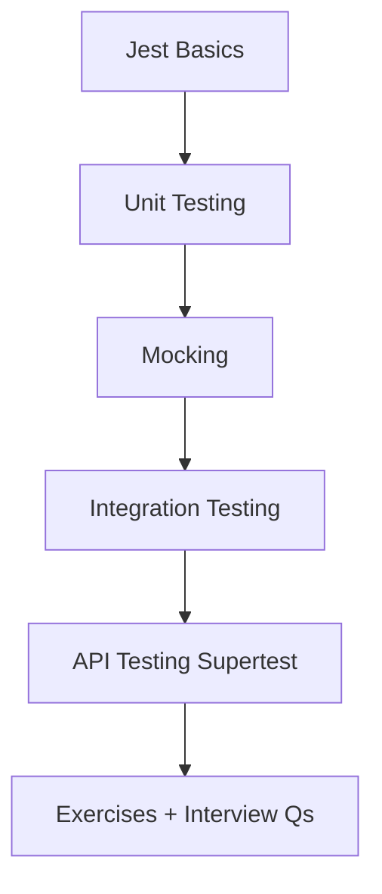
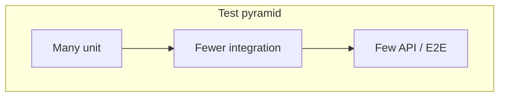

# 13 — Testing Node & Express

> Balanced pyramid: fast unit tests for pure logic, integration tests for DB/boundaries, and HTTP contract tests with Supertest.

---

## Who This Section Is For

- Engineers who “manual test” APIs and need interview-ready testing vocabulary
- Teams adopting Jest + Supertest for Express services
- Candidates asked how they would test auth, pagination, or payment flows

**Prerequisites:** Express routes, async/await, basic Mongo/Mongoose.

---

## Learning Roadmap

| Phase | Topics | Focus | Est. Time |
|-------|--------|-------|-----------|
| **1. Runner** | Jest basics | Arrange/Act/Assert, matchers | 0.5–1 day |
| **2. Pure logic** | Unit testing, mocking | Isolated functions, doubles | 1–2 days |
| **3. Boundaries** | Integration + API tests | DB, HTTP status/body contracts | 1–2 days |
| **4. Drill** | Exercises + Interview Qs | What to test vs not | Ongoing |

---

## Topic Index

| # | Topic | Folder | Key Interview Themes |
|---|--------|--------|----------------------|
| 1 | [Jest Basics](./jest-basics/README.md) | `jest-basics/` | Config, describe/it, coverage |
| 2 | [Unit Testing](./unit-testing/README.md) | `unit-testing/` | Pure functions, edge cases |
| 3 | [Integration Testing](./integration-testing/README.md) | `integration-testing/` | Real DB / testcontainers |
| 4 | [API Testing](./api-testing/README.md) | `api-testing/` | Supertest, auth headers |
| 5 | [Mocking](./mocking/README.md) | `mocking/` | `jest.mock`, spies, fakes |

**Practice**

- [Exercises](./exercises/README.md)
- [Interview Questions](./interview-questions/README.md)

---

## How to Study

1. Write a failing test first for one bug, then fix production code.
2. Prefer testing behavior (status + body) over private implementation details.
3. Use a disposable test database; never point tests at prod.
4. Mock external HTTP/payment SDKs; do not mock your own entire app blindly.
5. For each project in [19-Projects](../19-Projects/README.md), add at least one happy + one 401/400 path.

---

## Interview Focus

- Pyramid rationale: feedback speed vs confidence.
- Determinism: time, randomness, network flakiness.
- Testing authorization: wrong user cannot mutate another user’s resource.
- CI: run unit always; integration with services available.

---

## Common Pitfalls

- Snapshot-testing entire Express apps with no assertions on status.
- Shared mutable DB state between tests without cleanup.
- Over-mocking until tests only verify the mocks.
- Skipping unhappy paths (validation, 404, 403).

---

## Official Documentation

- [Jest](https://jestjs.io/docs/getting-started)
- [Supertest](https://github.com/ladjs/supertest)
