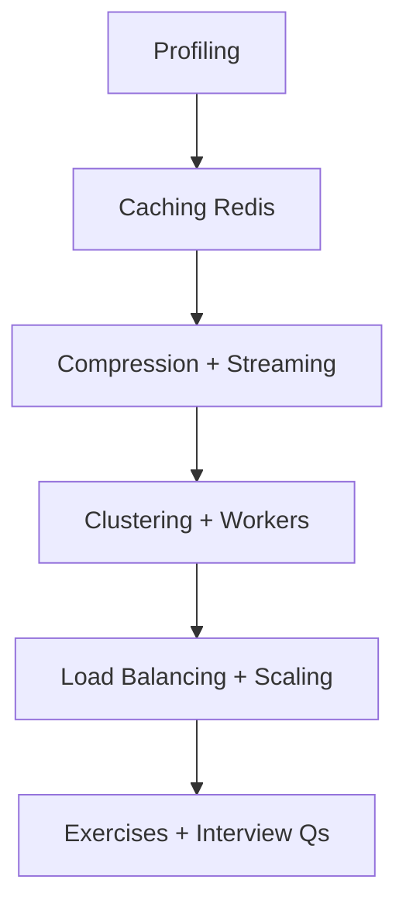
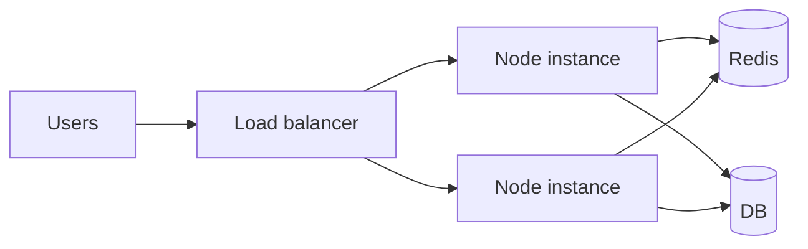

# 14 — Performance & Scaling

> Measure first. Optimize latency, throughput, memory, and cost without breaking correctness — caching, compression, streams, clustering, and load balancing.

---

## Who This Section Is For

- Backend engineers diagnosing slow APIs and hot event loops
- Candidates answering “how would you scale this Node service?”
- Anyone operating Redis caches or multi-instance Express apps

**Prerequisites:** Node event loop, HTTP, Mongo/SQL query basics.

---

## Learning Roadmap

| Phase | Topics | Focus | Est. Time |
|-------|--------|-------|-----------|
| **1. Measure** | Profiling | CPU, heap, slow queries | 1 day |
| **2. Cheap wins** | Caching, compression | TTLs, cache keys, gzip/br | 1–2 days |
| **3. I/O shape** | Streaming | Large payloads without buffering | 1 day |
| **4. Scale-out** | Clustering, LB, scaling | Processes, sticky sessions, H/V scale | 1–2 days |
| **5. Drill** | Exercises + Interview Qs | Bottleneck narratives | Ongoing |

---

## Topic Index

| # | Topic | Folder | Key Interview Themes |
|---|--------|--------|----------------------|
| 1 | [Caching and Redis](./caching-redis/README.md) | `caching-redis/` | Cache-aside, invalidation |
| 2 | [HTTP Compression](./compression/README.md) | `compression/` | CPU vs bandwidth |
| 3 | [Streaming](./streaming/README.md) | `streaming/` | Backpressure, ranges |
| 4 | [Load Balancing](./load-balancing/README.md) | `load-balancing/` | L7 vs L4, health checks |
| 5 | [Scaling](./scaling/README.md) | `scaling/` | Vertical vs horizontal |
| 6 | [Clustering](./clustering/README.md) | `clustering/` | cluster module, worker threads |
| 7 | [Profiling](./profiling/README.md) | `profiling/` | Clinic, `--inspect`, flamegraphs |

**Practice**

- [Exercises](./exercises/README.md)
- [Interview Questions](./interview-questions/README.md)

---

## How to Study

1. Define SLOs (p95 latency, error rate) before optimizing.
2. Profile a slow endpoint; fix the top contributor only.
3. Add cache-aside for a read-heavy path; discuss stampede and TTL.
4. Stream a large export instead of `JSON.stringify` of the whole set.
5. Explain multi-instance session/JWT and WebSocket sticky needs.

---

## Interview Focus

- “What did you measure?” — metrics before micro-optimizations.
- Cache key design and invalidation on writes.
- Event-loop blocking vs slow I/O (different fixes).
- Horizontal scale requires shared-nothing or externalized state.

---

## Common Pitfalls

- Caching user-specific data under a global key.
- Adding Redis before indexing the database.
- Premature clustering when the app is DB-bound.
- Ignoring memory growth from unbounded queues/caches.

---

## Official Documentation

- [Node.js Performance](https://nodejs.org/en/learn/getting-started/profiling)
- [Redis Docs](https://redis.io/docs/)
