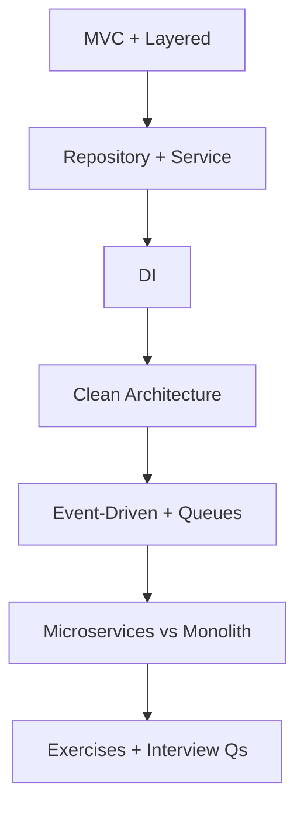
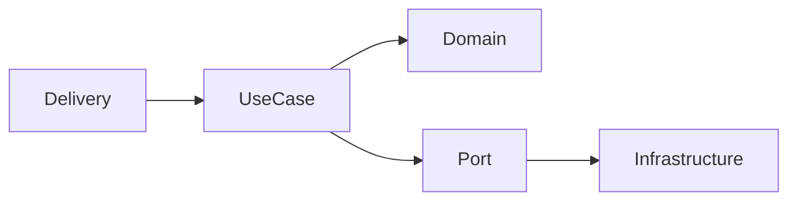

# 15 — Backend Architecture

> Assign responsibilities and control dependency direction. Prefer the smallest pattern that protects change, testing, and operations.

---

## Who This Section Is For

- Node developers structuring growing Express codebases
- Candidates drawing boxes for MVC, clean/layered architecture, and messaging
- Anyone choosing monolith vs microservices in system design interviews

**Prerequisites:** Express apps, databases, async messaging curiosity.

---

## Learning Roadmap

| Phase | Topics | Focus | Est. Time |
|-------|--------|-------|-----------|
| **1. Classic** | MVC, layered | Controllers thin, domain rules | 1 day |
| **2. Boundaries** | Repository/service, DI | Testability, swappable infra | 1–2 days |
| **3. Stricter** | Clean architecture | Ports/adapters, dependency rule | 1–2 days |
| **4. Distributed** | Events, queues, micro vs mono | Consistency, ops cost | 2 days |
| **5. Drill** | Exercises + Interview Qs | Justify a structure for a domain | Ongoing |

---

## Topic Index

| # | Topic | Folder | Key Interview Themes |
|---|--------|--------|----------------------|
| 1 | [MVC](./mvc/README.md) | `mvc/` | Separation of concerns |
| 2 | [Clean Architecture](./clean-architecture/README.md) | `clean-architecture/` | Dependency rule |
| 3 | [Layered Architecture](./layered/README.md) | `layered/` | Controller → service → data |
| 4 | [Repository and Service](./repository-service/README.md) | `repository-service/` | Persistence abstraction |
| 5 | [Dependency Injection](./dependency-injection/README.md) | `dependency-injection/` | Constructor injection |
| 6 | [Event-Driven](./event-driven/README.md) | `event-driven/` | Async decoupling |
| 7 | [Microservices vs Monolith](./microservices-monolith/README.md) | `microservices-monolith/` | Team/scale trade-offs |
| 8 | [Message Queues](./message-queues/README.md) | `message-queues/` | At-least-once, idempotency |

**Practice**

- [Exercises](./exercises/README.md)
- [Interview Questions](./interview-questions/README.md)

---

## How to Study

1. Refactor one fat route handler into controller → service → repository.
2. Draw dependency arrows; ensure domain does not import Express/Mongoose.
3. Add an outbox/queue sketch for “email after signup.”
4. Argue monolith-first unless you have a clear scale/team boundary.
5. Map each [19-Projects](../19-Projects/README.md) domain to a folder structure.

---

## Interview Focus

- Why thin controllers and fat domain/services.
- Idempotent consumers for at-least-once queues.
- When microservices increase failure modes (network, dual writes).
- Repository pattern: test domain without a live DB.

---

## Common Pitfalls

- “Clean architecture” folders with business logic still in routes.
- Distributed monolith: many services, shared DB, chatty sync calls.
- Events without schema/versioning or poison-message handling.
- Premature abstraction (interfaces for one implementation forever).

---

## Official Documentation

- [Microsoft — Clean Architecture](https://learn.microsoft.com/en-us/dotnet/architecture/modern-web-apps-azure/common-web-application-architectures)
- [MariaDB/Postgres — transactions](https://www.postgresql.org/docs/current/tutorial-transactions.html) (consistency backdrop)
