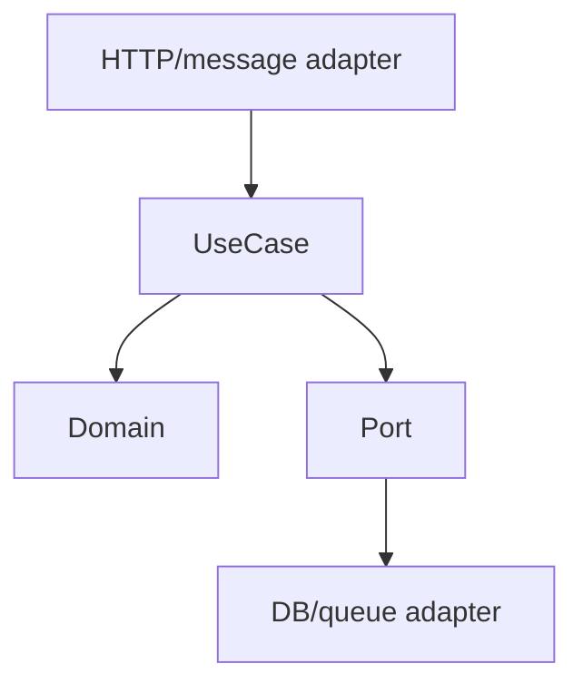

# Clean Architecture

Business rules are independent from frameworks and databases; dependencies point inward.

## What to know

- **Layers:** Entities, application use cases, interface adapters, then frameworks/drivers.
- **Benefit:** Test domain policy without Express/Mongo; adapters absorb infrastructure changes.

## Flow



## Interview answer framework

State the problem first, identify the trust or responsibility boundary, explain the implementation choice, and finish with a trade-off or failure mode. Server-side validation and authorization are mandatory even when a client also performs checks.

## Run the example

```bash
node example.js
```

Examples show the essential control-flow shape. Install the named dependencies, validate configuration at startup, and use real secrets only through a secret manager or environment.

## Questions to rehearse

1. What threat, failure, or scaling problem does this solve?
2. Which input or dependency is untrusted, and where is it constrained?
3. What metric, test, or log would prove it works in production?
