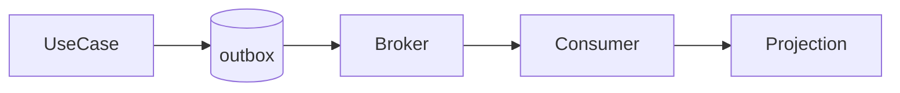

# Event-Driven Architecture

Publish domain facts for asynchronous consumers. This increases decoupling but creates eventual consistency and retry requirements.

## What to know

- **Delivery:** Assume at-least-once delivery and make consumers idempotent.
- **Reliability:** Use an outbox to atomically record state change and publication intent.

## Flow



## Interview answer framework

State the problem first, identify the trust or responsibility boundary, explain the implementation choice, and finish with a trade-off or failure mode. Server-side validation and authorization are mandatory even when a client also performs checks.

## Run the example

```bash
node example.js
```

Examples show the essential control-flow shape. Install the named dependencies, validate configuration at startup, and use real secrets only through a secret manager or environment.

## Questions to rehearse

1. What threat, failure, or scaling problem does this solve?
2. Which input or dependency is untrusted, and where is it constrained?
3. What metric, test, or log would prove it works in production?
