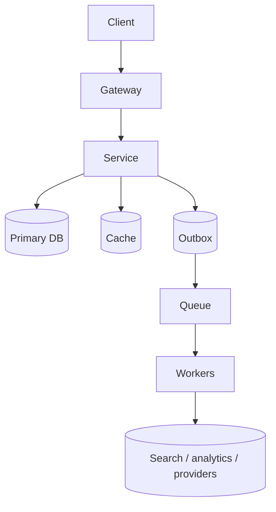
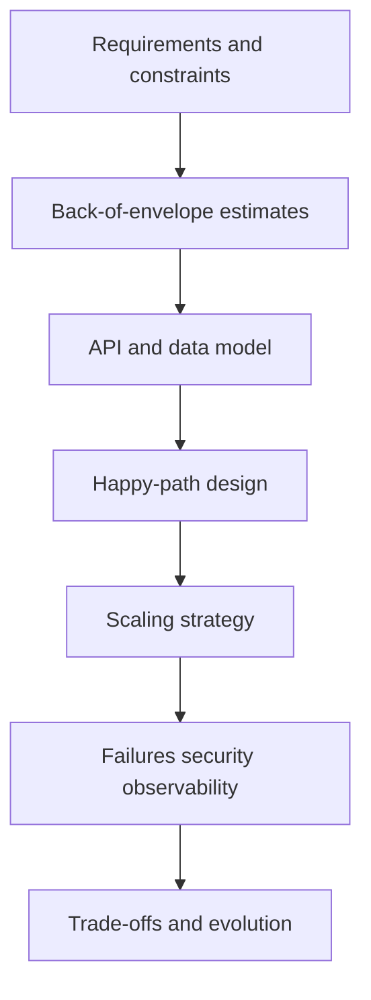

# Backend System Design Interview Playbook

System design interviews measure structured reasoning under constraints. Memorizing one architecture is not enough — you must clarify scope, estimate load, propose a workable design, and defend trade-offs.

## Timed interview framework (45–60 minutes)

| Phase | Time | What to do |
|---|---:|---|
| Clarify | 5–8 min | Users, core actions, out of scope, SLOs, consistency, retention, regions |
| Estimate | 5–8 min | DAU → QPS, storage, bandwidth; state assumptions aloud |
| API + data | 5–8 min | Endpoints, entities, indexes, idempotency, pagination |
| HLD | 10–15 min | Happy path: client → gateway → service → DB → async side effects |
| Deep dives | 10–15 min | Cache, sharding, queues, consistency, security, failure modes |
| Trade-offs | 3–5 min | What changes at 10×; what you would cut for an MVP |

## 1. Clarify requirements

Ask before drawing:

- **Who** uses the system (B2C, B2B tenants, internal)?
- **Core flows** vs nice-to-haves (MVP vs full product)?
- **Read/write ratio**, peak vs average, geographic distribution?
- **Latency SLOs** (p99) and availability target (e.g. 99.9%)?
- **Consistency**: strong, read-your-writes, eventual?
- **Data retention**, compliance (PII, PCI, GDPR)?
- **Abuse model**: bots, spam, DDoS, credential stuffing?

Write functional vs non-functional lists on the board. Explicitly park out-of-scope items.

## 2. Capacity estimation (back-of-envelope)

State assumptions, then derive:

```
DAU = 10M
Actions/user/day = 20  →  requests/day = 200M
Avg QPS ≈ 200M / 86400 ≈ 2,300
Peak QPS ≈ 3–5× avg ≈ 7k–12k

Storage/day = events × avg_bytes
Bandwidth = QPS × avg_payload
```

Always estimate:

1. Peak QPS (read and write separately)
2. Storage growth (1 year)
3. Cache hit ratio needed for latency
4. Fan-out or queue throughput if async

Round numbers are fine. Interviewers care that you can convert product numbers into engineering load.

## 3. API design

- Version public APIs (`/v1/...`).
- Use clear resource nouns; prefer POST for commands with side effects.
- Require **idempotency keys** on create/payment/command retries.
- Cursor pagination for large collections; never deep OFFSET at scale.
- Return stable error shapes (status + code + message).
- Document auth (Bearer JWT, API key) and rate-limit headers.

## 4. Data model

- List entities, primary keys, uniqueness constraints, and indexes that match access paths.
- Separate **hot path** tables from append-only analytics.
- Call out TTL, soft-delete vs hard-delete, and audit needs.
- Justify SQL vs NoSQL vs blob vs search index per access pattern — not by fashion.

## 5. High-level design (HLD)

Start simple:



Only then add CDN, shards, multi-region, or CQRS when a bottleneck or requirement forces it.

## 6. Deep dives (pick what the interviewer cares about)

| Topic | Questions to answer |
|---|---|
| Caching | What key? TTL? Invalidation? Stampede? |
| Consistency | Which ops need strong consistency? |
| Scaling | Vertical first? Replica reads? Shard key? |
| Async | Outbox vs dual-write? At-least-once + idempotency? |
| Security | AuthZ boundaries, secrets, PII, abuse controls |
| Observability | RED metrics, traces, alerts tied to user impact |
| Failure | Timeouts, retries with jitter, circuit breakers, DLQ, DR |

## 7. Trade-offs and evolution

Always say:

- MVP design for current scale / small team
- What breaks at 10× and 100×
- Cost vs latency vs complexity
- Consistency vs availability for the critical path

## Architecture vocabulary (interview narrative)



## Strong interview habits

- Narrate assumptions; silence hides reasoning.
- Draw the **synchronous** path before queues and caches.
- Prefer **idempotency** over claiming exactly-once delivery.
- Define consistency **per operation**, not as a global adjective.
- Separate durable commands from async side effects (outbox / event stream).
- Include authZ, tenant isolation, encryption, and abuse prevention early.
- Tie every component to a metric that proves it is healthy.

## Practice systems (this folder)

| System | Focus areas |
|---|---|
| [URL shortener](url-shortener/README.md) | High read QPS, ID generation, CDN, analytics off critical path |
| [Chat application](chat-application/README.md) | WebSockets, ordering, fan-out, presence |
| [Notification system](notification-system/README.md) | Multi-channel, retries, preferences, DLQ |
| [Payment gateway](payment-gateway/README.md) | Idempotency, webhooks, ledger, reconciliation |
| [Auth service](auth-service/README.md) | Tokens, sessions, MFA, revocation |
| [Rate limiter](rate-limiter/README.md) | Algorithms, Redis atomicity, fail-open/closed |
| [File upload service](file-upload-service/README.md) | Presigned URLs, scanning, quotas |
| [Logging service](logging-service/README.md) | Ingestion, retention, search, PII |
| [E-commerce backend](ecommerce-backend/README.md) | Inventory, checkout saga, catalog cache |

## How to practice

1. Pick one system; set a 35-minute timer.
2. Speak aloud: clarify → estimate → API → HLD → one deep dive → trade-offs.
3. Compare against the topic README; note gaps.
4. Re-run the same system focusing only on failures and security.

Aim for a 10-minute baseline sketch and a 35-minute deep dive for each topic before interviews.
