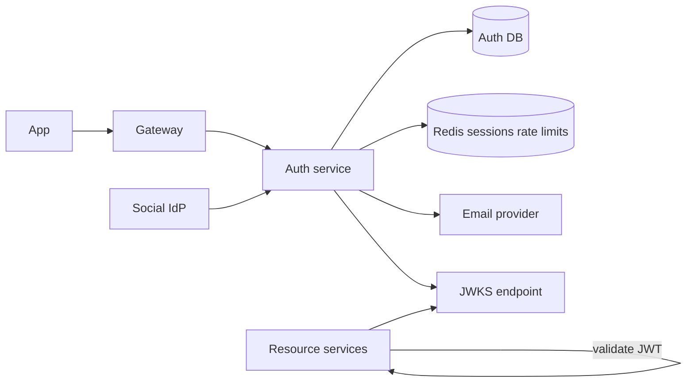
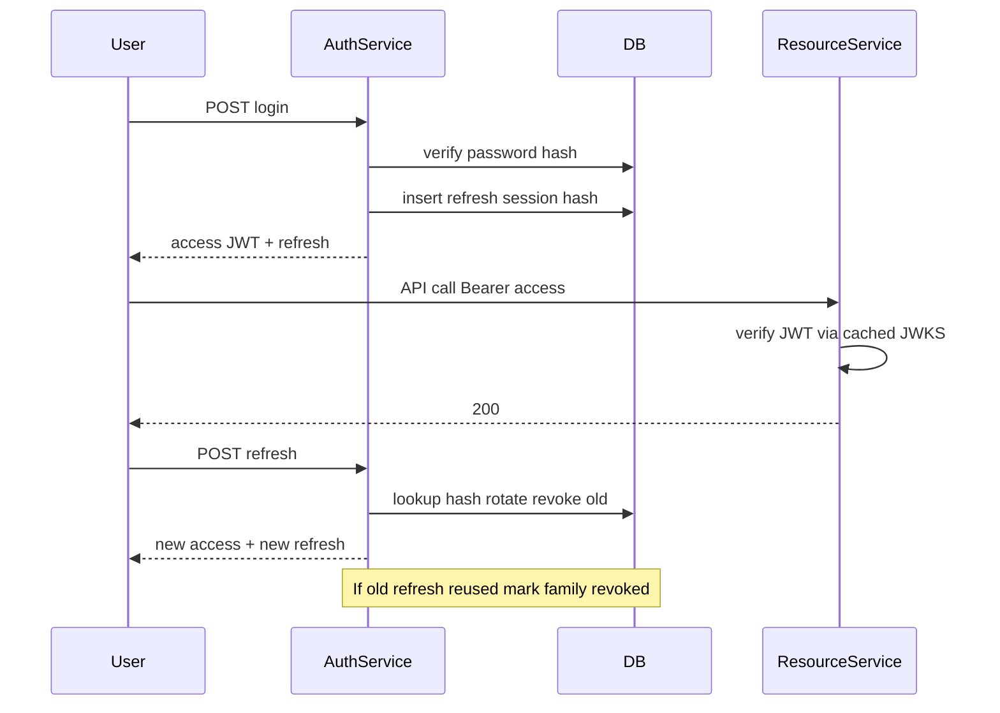

# Authentication and Authorization Service

Design a centralized identity service that registers users, authenticates them, issues credentials, and supports authorization for resource servers — without distributing password handling across every app.

## Clarifying questions

- First-party apps only or third-party OAuth/OIDC clients?
- Session cookies vs Bearer JWT vs opaque tokens?
- MFA required? Which factors?
- Social login (Google/Apple)?
- Machine-to-machine (client credentials)?
- Immediate revocation needs?
- Multi-tenant (orgs, SSO/SAML)?
- Expected login QPS and active sessions?

## Functional requirements

1. Signup, login, logout, password reset.
2. MFA enrollment and challenge.
3. Issue short-lived access tokens + refresh tokens (or sessions).
4. Refresh rotation and reuse detection.
5. Roles/permissions (RBAC) or scopes; optional ABAC later.
6. JWKS / OIDC discovery for resource servers.
7. Admin: disable user, revoke sessions.

## Non-functional requirements

| Attribute | Target (example) |
|---|---|
| Login latency | p99 &lt; 200–400 ms (excluding MFA UX) |
| Security | Argon2/bcrypt, rate limits, lockouts, audit |
| Availability | Auth outage = product outage — multi-AZ |
| Revocation | Refresh/session revoke near-immediate; JWT access eventual |
| Compliance | Secure password storage; PII controls |

## Capacity estimation (example)

- 20M MAU; 2M DAU; each opens app 5×/day → ~10M token refresh or session checks/day
- Peak login 500/s during incidents/sales
- Refresh tokens stored hashed; 5 devices/user → tens of millions of session rows
- JWKS fetched rarely by services (cache aggressively)

Auth traffic is bursty (launches, outages, credential stuffing).

## API design

```
POST /v1/auth/signup     { email, password }
POST /v1/auth/login      { email, password, deviceId } → { accessToken, refreshToken, expiresIn }
POST /v1/auth/mfa/verify { mfaToken, code }
POST /v1/auth/refresh    { refreshToken }
POST /v1/auth/logout     { refreshToken } or all sessions
POST /v1/auth/password/forgot
POST /v1/auth/password/reset

GET  /.well-known/openid-configuration
GET  /v1/jwks.json

POST /oauth/token        // authorization_code / client_credentials
GET  /oauth/authorize
```

Resource servers validate JWT locally (issuer, audience, signature, exp) or introspect opaque tokens.

## Data model

### `users`

`{ id, email UNIQUE, password_hash, status, mfa_enabled, created_at }`

### `mfa_factors`

`{ user_id, type, secret_encrypted, verified_at }`

### `refresh_sessions`

`{ id, user_id, token_hash, family_id, expires_at, revoked_at, user_agent, ip }`  
Indexes: `token_hash`, `(user_id, revoked_at)`, TTL on `expires_at`.

### `roles` / `role_bindings` / `permissions`

`{ role, permission }` and assignments to users or clients.

### `audit_events`

Login success/failure, refresh reuse, password change, admin revoke.

## High-level architecture



## Sequence: login + refresh rotation



## Token strategy

| Approach | Pros | Cons |
|---|---|---|
| JWT access + rotating refresh | Stateless validate; scalable | Revoke access before expiry is hard |
| Opaque access + introspection | Immediate revoke | Introspection dependency / cache |
| Server sessions (cookie) | Simple first-party web | CSRF, sticky scaling, less ideal for pure APIs |

Interview default: **short JWT access (5–15 min) + refresh rotation + server-side refresh store**.

## Caching

- JWKS cached by resource services (respect key rotation / `kid`).
- Permission maps cached with short TTL; invalidate on role change.
- Rate-limit counters in Redis for `/login`, `/refresh`, `/forgot`.
- Optional session deny-list for emergency JWT revoke (jti denylist) until expiry.

## Database choice

PostgreSQL (or similar) for users/sessions/audit. Redis for rate limits and optional denylist. Never store plaintext refresh tokens — store **hash** (like passwords). Secrets for MFA in KMS-backed encryption.

## Scaling

- Stateless auth API replicas.
- Read replicas for user profile; primary for credential writes.
- Shard sessions by `user_id` if huge.
- Protect with WAF / bot management against stuffing.
- Separate “public auth” endpoints from internal admin APIs.

## Bottlenecks

1. Password hashing CPU (Argon2) — capacity plan; consider async carefully (usually sync).
2. Credential stuffing volume — rate limit + CAPTCHA + IP reputation.
3. Hot JWKS during key rotation mishaps.
4. Large permission checks if naïve DB join every request — cache claims/roles in token carefully (size vs freshness).

## Failure modes

| Failure | Mitigation |
|---|---|
| Refresh theft | Rotation + reuse detection revokes family |
| Key compromise | Rotate signing keys; short access TTL; revoke refresh |
| Redis down | Fail closed on login rate limits? Prefer fail closed for auth abuse endpoints |
| Clock skew | Leeway seconds on JWT `exp`/`nbf` |
| Email provider down | Queue reset emails; do not reveal user enumeration carelessly |

## Security checklist (say these out loud)

- Argon2id/bcrypt with proper parameters; pepper optional in KMS.
- Constant-time compare; generic error messages where appropriate.
- HTTPS only; secure cookie flags if cookies used.
- CSRF strategy for cookie sessions.
- PKCE for public OAuth clients.
- Audience and issuer validation on every resource service.
- Audit privileged actions.

## Trade-offs

- Fat JWT (roles inside) → fewer lookups, stale authZ, larger tokens.
- Thin JWT (sub only) → fresh permissions, more dependency on auth service.
- Global logout immediate vs wait for access expiry.
- Central auth monolith vs vendor IdP (Auth0/Cognito) — build vs buy.

## Interview talking points

- Never store raw passwords or raw refresh tokens.
- Explain refresh **reuse detection** clearly — it shows seniority.
- Resource services should not call auth on every request if JWT works.
- Distinguish authentication (who) vs authorization (what).
- MFA for privileged actions and risky logins (new device).

## Deep-dive prompts

- Design org SSO (SAML/OIDC) for B2B.
- Step-up authentication for payments.
- Service-to-service auth (mTLS vs JWT client credentials).
- Account recovery without SMS SIM-swap risk.
