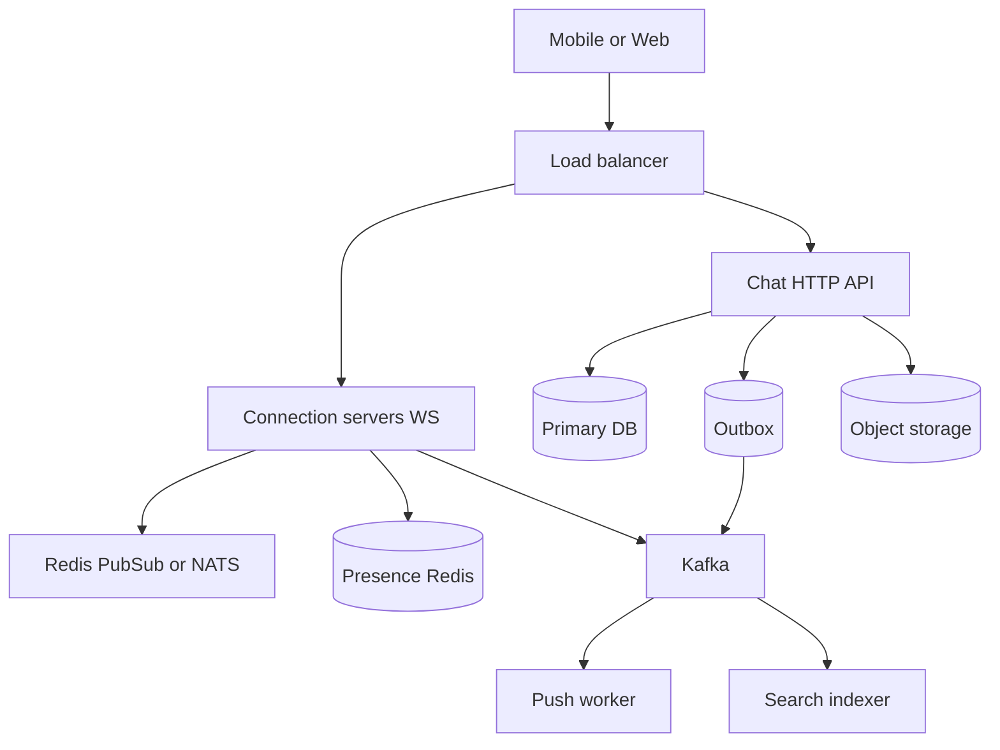
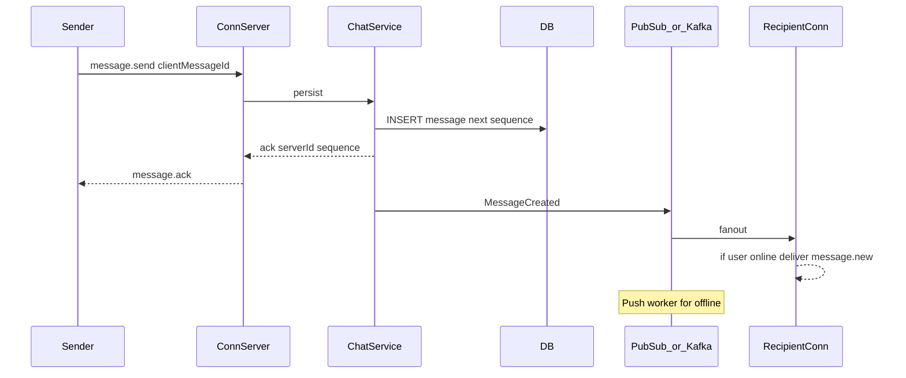

# Realtime Chat Application

Design a messaging system for 1:1 and group chat with reliable history and low-latency delivery to online users.

## Clarifying questions

- 1:1 only, groups, or channels (large fan-out)?
- Max group size? Broadcast to 100 vs 100k is a different design.
- Delivery guarantees: at-least-once? Ordered per conversation?
- Media attachments? Typing indicators? Read receipts? Presence?
- Mobile offline sync and push notifications when offline?
- E2E encryption required? Retention / delete-for-everyone?
- Expected DAUs and messages/day?

## Functional requirements

1. Send/receive messages in conversations.
2. Persist history; paginate older messages.
3. Realtime delivery via WebSocket (or similar) when online.
4. Membership: create DM/group, add/remove members.
5. Optional: typing, read receipts, presence, search, media.

## Non-functional requirements

| Attribute | Target (example) |
|---|---|
| Online delivery latency | p99 &lt; 200–500 ms same region |
| Durability | Messages persisted before ACK to sender |
| Ordering | Per-conversation order (not global) |
| Availability | Chat history always readable; realtime best-effort under partition |
| Scale | Millions of concurrent connections |

## Capacity estimation (example)

Assumptions:

- 50M DAU; 20 messages/user/day → 1B messages/day ≈ 12k msg/s avg; peak ≈ 50k msg/s
- Avg message 200 bytes metadata + body → ~2.4 MB/s avg ingest; peak ~10 MB/s
- Concurrent WS connections: 10M online → connection servers need horizontal scale
- Fan-out: average group size 5 → fan-out write amplification ×5 for push; large channels need different pattern

Storage/year: 1B/day × 365 × 300 bytes ≈ 100+ TB (plan cold storage / compaction).

## API design

### REST / HTTP

```
POST /v1/conversations  { type, memberIds[] }
GET  /v1/conversations?cursor=
GET  /v1/conversations/{id}/messages?cursor=&limit=
POST /v1/conversations/{id}/members  { userId }
POST /v1/devices  { pushToken, platform }
```

### WebSocket (authenticated)

```
→ auth { accessToken }
→ message.send { conversationId, clientMessageId, body, replyTo? }
← message.ack { clientMessageId, serverMessageId, sequence, createdAt }
← message.new { ... }
→ receipt.read { conversationId, upToSequence }
→ typing.start { conversationId }
← presence.update { userId, status }
```

Idempotency: unique `(senderId, clientMessageId)` or `(conversationId, clientMessageId)`.

## Data model

### `conversations`

`{ id, type: dm|group, created_at, last_message_at }`

### `conversation_members`

`{ conversation_id, user_id, joined_at, role, last_read_sequence }`  
Indexes: `(user_id, last_message_at)` for inbox; `(conversation_id, user_id)` unique.

### `messages`

`{ id, conversation_id, sender_id, body, sequence, client_message_id, created_at, deleted_at }`  
Unique: `(conversation_id, sequence)`, `(conversation_id, sender_id, client_message_id)`.  
Index: `(conversation_id, created_at)` / `(conversation_id, sequence)` for pagination.

### Supporting

- `attachments` metadata → object storage keys
- `push_tokens` per device
- Optional search index of message text (async)

## High-level architecture



Pattern:

1. Persist message (assign sequence) in DB.
2. Publish to conversation partition / pub-sub.
3. Connection servers deliver to online members.
4. Offline members get push via worker.
5. Typing/presence are ephemeral — not durable.

## Sequence: send message



## Ordering and fan-out

- **Per-conversation sequence** (monotonic) assigned at write time by a single writer or conditional update / DB sequence.
- Partition Kafka by `conversationId` so consumers see order.
- Small groups: **write fan-out** to member inboxes or pub-sub channels.
- Large channels: **read fan-out** — store once; clients pull; push only badges/mentions.

## Caching

- Recent messages per conversation in Redis (optional).
- Presence and typing in Redis with short TTL.
- Connection registry: `userId → { serverId, connId }`.
- Inbox list cached carefully; invalidate on new message.

## Database choice

| Store | Use |
|---|---|
| PostgreSQL / Cassandra / DynamoDB | Message history; pick for access pattern |
| Redis | Presence, pub-sub, connection map, rate limits |
| Kafka / Redis Streams | Fan-out and async push/search |
| Object storage | Media |
| OpenSearch | Message search |

Cassandra/Dynamo shine for huge append-only message volumes keyed by conversation; Postgres is fine for MVP / moderate scale with partitioning.

## Scaling

- Sticky sessions or connection registry so any API can publish to the right conn server.
- Horizontal conn servers; each holds tens of thousands of sockets.
- Shard conversations by ID.
- Separate realtime plane from history API.
- Rate-limit sends per user; backpressure when fan-out lags.

## Bottlenecks

1. Hot conversations (celebrity channels) — use read fan-out.
2. Connection server memory and file descriptors.
3. Sequence assignment contention if naïve locking.
4. Push provider rate limits.
5. Cross-region latency for global users.

## Failure modes

| Failure | Handling |
|---|---|
| Sender retry | Dedupe via `clientMessageId` |
| Conn server crash | Client reconnects; resume from last sequence / cursor |
| At-least-once delivery | Client dedupes by server message id |
| DB unavailable | Fail send (do not ACK); history read may use replicas |
| Split brain presence | Ephemeral; tolerate wrong “online” briefly |
| Kafka lag | Online users may still get pub-sub; push delayed |

## Trade-offs

- Global total order is expensive and unnecessary.
- Exactly-once across devices is unrealistic; design for idempotent clients.
- Storing typing events durably wastes money.
- E2E encryption complicates search and server-side features.
- Microservices early vs modular monolith for message + membership.

## Interview talking points

- Separate **durable message path** from **ephemeral typing/presence**.
- Explain reconnect: client sends `afterSequence`; server pages missed messages.
- Group of 5 vs 100k: write fan-out vs read fan-out.
- ACK means persisted, not “everyone read it”.
- Push notifications are a different pipeline with preference and quiet hours.

## Deep-dive prompts

- How do you assign `sequence` without bottlenecks?
- Design read receipts that do not create a write storm.
- Multi-device sync for the same user.
- Message delete/edit semantics and cache invalidation.
