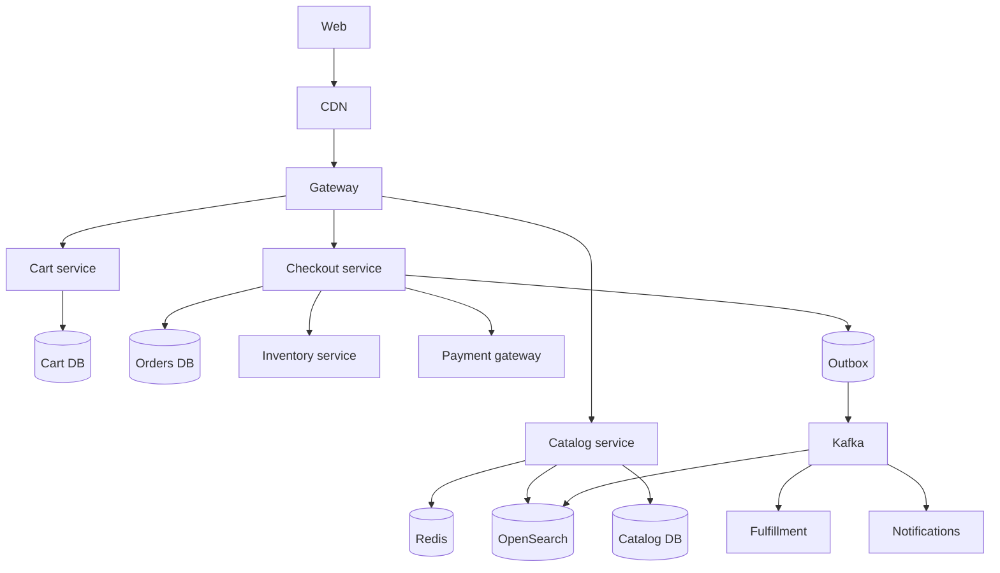
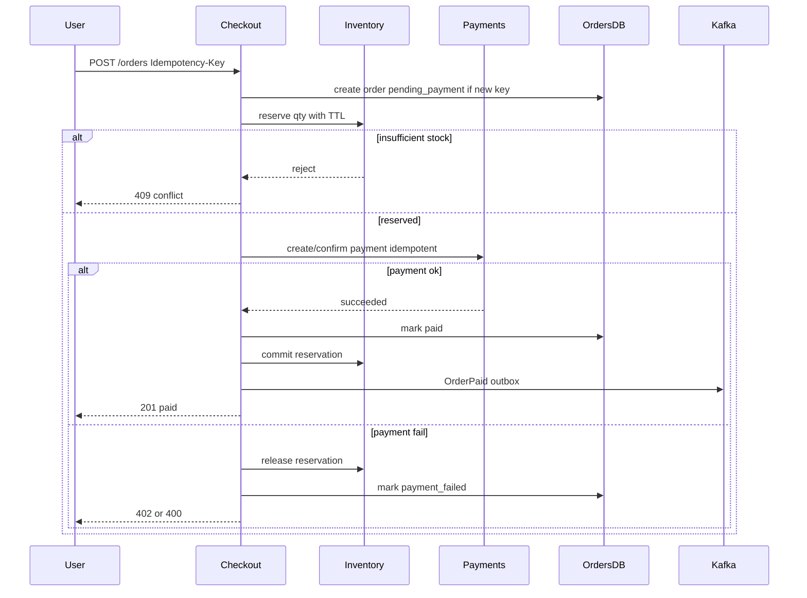

# E-commerce Backend

Design a backend that supports catalog browsing and a reliable checkout flow that avoids overselling inventory while integrating payments and fulfillment.

## Clarifying questions

- Marketplace (multi-seller) or single merchant?
- Guest checkout? International tax/shipping?
- Strong inventory consistency (no oversell) required?
- Flash sales / limited drops?
- Catalog size; search facets needed?
- Payment processor; sync vs async capture?
- Order volume/day and peak (Black Friday multiplier)?

## Functional requirements

1. Product catalog browse/search.
2. Cart management.
3. Checkout: reserve inventory, take payment, create order.
4. Order status, cancellation, refunds.
5. Fulfillment handoff; stock adjustments on ship/return.
6. Notifications (order confirmation, shipped).
7. Admin: catalog and inventory ops.

## Non-functional requirements

| Attribute | Target (example) |
|---|---|
| Catalog read latency | p99 low hundreds of ms with cache/CDN |
| Checkout correctness | No double charge; no silent oversell |
| Availability | Browse highly available; checkout consistent |
| Peak scale | 10× normal on sale events |
| Auditability | Price snapshots on orders |

## Capacity estimation (example)

- 2M DAU; 5% convert → 100k orders/day ≈ 1.2 orders/s avg; peak 50/s (sale)
- Browse QPS 10k peak; search 2k
- Catalog 1M SKUs; product JSON 5 KB → cacheable
- Inventory updates << browse traffic but **contention-sensitive**
- Cart writes moderate; carts expire

Optimize read path heavily; keep checkout transactional and boring.

## API design

```
GET  /v1/products?query=&cursor=
GET  /v1/products/{id}
POST /v1/carts                    → cartId
POST /v1/carts/{id}/items         { variantId, qty }
PATCH /v1/carts/{id}/items/{variantId}
POST /v1/checkout/sessions        { cartId, shippingAddress }
POST /v1/orders
Idempotency-Key: ...
Body: { checkoutSessionId, paymentMethodToken }
→ 201 { orderId, status }

GET  /v1/orders/{id}
POST /v1/orders/{id}/cancel
```

Idempotent order creation is mandatory.

## Data model

### Catalog

- `products`, `variants` (sku, price, attributes)
- Search index documents derived asynchronously

### Inventory

`inventory(variant_id, warehouse_id, on_hand, reserved)`  
Unique `(variant_id, warehouse_id)`.

`reservations(id, variant_id, warehouse_id, qty, order_id, expires_at, status)`

### Carts

`carts`, `cart_items` with TTL; prices re-validated at checkout.

### Orders

`orders(id, user_id, status, currency, totals, shipping_address_snapshot, created_at)`  
`order_items(... price_snapshot, qty)`  
Statuses: `pending_payment → paid → fulfilling → shipped → completed` (+ `canceled`, `refunded`).

### Payments

Reference to payment intent id; do not store PAN.

## High-level architecture



MVP acceptable as **modular monolith** with clear modules; extract services when teams/scale demand.

## Sequence: checkout without oversell



## Inventory strategies

1. **Optimistic conditional update**: `UPDATE inventory SET on_hand = on_hand - n WHERE on_hand - reserved >= n`.
2. **Reservation rows** with TTL for checkout sessions (best for multi-step checkout).
3. **Single-threaded inventory per SKU** via partition/queue for extreme flash sales.

Avoid long DB transactions spanning the payment provider call — reserve → pay → commit/release.

## Caching

- Product pages and category listings in Redis/CDN.
- Invalidate or version on price/stock display (stock display can be slightly stale; reservation is authoritative).
- Search index eventual.
- Cart in Redis optional with DB backup.

## Database choice

| Data | Store |
|---|---|
| Orders, inventory, payments refs | PostgreSQL (transactions) |
| Catalog browse | SQL + Redis; search via OpenSearch |
| Cart | Redis + SQL or SQL only |
| Async workflows | Kafka + workers |
| Media | Object storage |

## Scaling

- Read replicas / CDN for catalog.
- Shard orders by `order_id` or `user_id` later; inventory shard by `variant_id`.
- Checkout service scaled on CPU/DB connections carefully.
- Queue fulfillment and email off the request path.
- Load-test flash-sale SKUs specifically.

## Bottlenecks

1. Hot SKU inventory row contention.
2. Search cluster during sales.
3. Payment processor rate limits.
4. Cache stampede on popular product.
5. Cart abandonment jobs vs active checkout races.

## Failure modes

| Failure | Mitigation |
|---|---|
| Payment timeout after charge | Idempotent retrieve; webhook; do not double create order |
| Reservation expired mid-pay | Fail checkout; release; user retries |
| Fulfillment worker crash | At-least-once + idempotent ship create |
| Oversell bug | Conditional updates + metrics on negative stock; compensating cancel |
| Price change during cart | Snapshot at order time; show confirmation screen |

## Saga / compensation

Checkout is a saga:

1. Create order pending
2. Reserve stock
3. Charge payment
4. Mark paid / emit events
5. On failure: release stock, cancel order, refund if charged

Use **orchestrator** (checkout service) for clarity in interviews; choreography also acceptable if you explain events.

## Trade-offs

- Microservices vs modular monolith for small teams.
- Strong inventory vs soft oversell + apologize (marketplace dependent).
- Synchronous payment UX vs async order confirmation.
- Exact stock on PDP vs “only 3 left” eventually consistent badge.

## Interview talking points

- Walk **checkout state machine** end-to-end.
- Idempotent `POST /orders`.
- Price snapshots on line items.
- Reservation TTL and payment timeout interaction.
- Catalog can be eventual; **money + stock commit** cannot be casual.
- Outbox for OrderPaid → notify/fulfill/search.

## Deep-dive prompts

- Flash sale of 100 units / 100k users.
- Multi-warehouse allocation and partial shipment.
- Promotions/coupons engine consistency.
- Returns and restocking.
- Multi-currency and tax.
