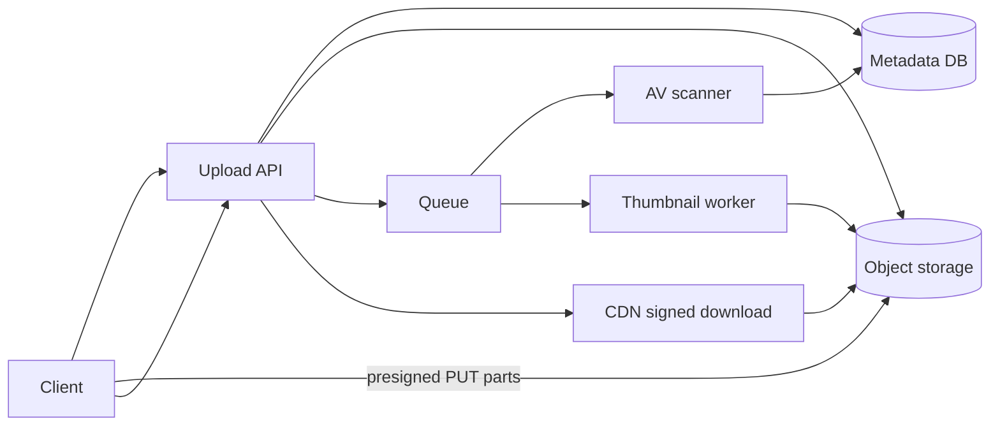
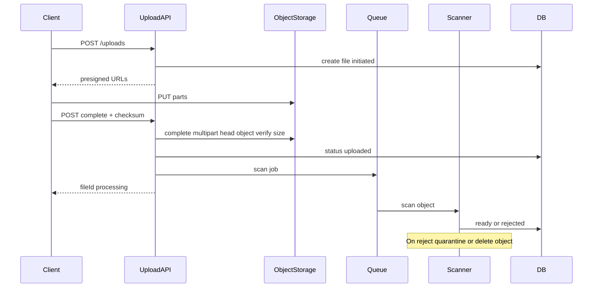

# File Upload Service

Design a service that lets clients upload large files securely without proxying entire byte streams through application servers, then scan, process, and serve downloads.

## Clarifying questions

- Max file size? Multipart / resumable required?
- File types allowed (images, video, docs)?
- Virus/malware scanning required before download?
- Transformations (thumbnails, transcoding)?
- Per-user quotas and retention/TTL?
- Public vs private files? Signed download URLs?
- Expected uploads/day and average size?
- Browser, mobile, or server-to-server uploads?

## Functional requirements

1. Initiate upload; get instructions for direct-to-storage upload.
2. Support multipart / resumable uploads for large objects.
3. Complete upload; verify checksum; record metadata.
4. Async virus scan and optional processing pipeline.
5. Authorize download via short-lived signed URLs.
6. Enforce quotas; expire or delete abandoned uploads.

## Non-functional requirements

| Attribute | Target (example) |
|---|---|
| App server bandwidth | Minimal — bytes go to object storage |
| Reliability | Resumable on flaky mobile networks |
| Security | AuthZ, content validation, malware gate |
| Latency | Initiate/complete API fast; upload bound by client bandwidth |
| Durability | Object storage 11 nines class; metadata in DB |

## Capacity estimation (example)

- 1M uploads/day; avg 5 MB → ~5 TB/day ingress
- Peak: 50 uploads/s initiate; storage write bandwidth dominated by object store
- Metadata ~1 KB/file → trivial vs blobs
- Thumbnail workers: 20% of uploads are images → size worker pool by queue lag
- CDN egress may exceed ingest

App servers only handle control-plane QPS (hundreds), not multi-GB/s payloads.

## API design

```
POST /v1/uploads
Auth: Bearer
Body: { filename, contentType, size, checksumSha256? }
→ 201 {
  uploadId,
  strategy: "s3_multipart",
  bucket,
  key,
  parts: [{ partNumber, url }],  // or single PUT URL
  expiresAt
}

PUT <presigned part URL>   // client → object storage directly

POST /v1/uploads/{uploadId}/complete
Body: { parts: [{ partNumber, etag }], checksumSha256 }
→ 200 { fileId, status: "processing" }

GET /v1/files/{fileId}
→ metadata + status (uploading|scanning|ready|rejected)

GET /v1/files/{fileId}/download
→ 302 / JSON { url: signedUrl, expiresAt }

DELETE /v1/files/{fileId}
```

Optional tus/resumable protocol for mobile.

## Data model

### `files`

`{ id, owner_id, bucket, object_key UNIQUE, filename, content_type, size, checksum, status, scan_status, created_at, expires_at }`  
Indexes: `(owner_id, created_at)`, `object_key`.

Statuses: `initiated → uploaded → scanning → ready | rejected | failed`.

### `upload_sessions`

`{ id, file_id, multipart_upload_id, expires_at, bytes_reported }`

### `processing_jobs`

`{ file_id, type: scan|thumbnail|transcode, status, attempts }`

Quotas: `user_usage(owner_id) → bytes_used, file_count` updated transactionally on complete/delete.

## High-level architecture



## Sequence: direct upload



## Caching

- CDN for public/cacheable derivatives (thumbnails).
- Metadata cache for hot file records (invalidate on status change).
- Do not cache private signed URLs long — short expiry.
- Presign credentials never logged.

## Database choice

| Store | Role |
|---|---|
| PostgreSQL | Metadata, quotas, job state |
| S3 / GCS / Azure Blob | Bytes |
| Redis | Rate limits, upload locks |
| Queue (SQS/Kafka) | Scan/transcode |
| CDN | Downloads |

## Scaling

- Control plane horizontally scaled; data plane is object storage + CDN.
- Parallel part uploads (client-side).
- Worker autoscaling on queue depth.
- Lifecycle policies abort incomplete multipart uploads after N days.
- Partition processing by `file_id`.

## Bottlenecks

1. Naive proxy upload through Node — avoid.
2. AV scanner throughput.
3. Viral public file download — CDN + cache headers.
4. Quota check races — transactional increment / conditional update.
5. Small-file chatty multipart overhead — use single PUT under threshold.

## Failure modes

| Failure | Mitigation |
|---|---|
| Client dies mid-upload | Session TTL; lifecycle abort multipart; mark expired |
| Complete with wrong checksum | Reject; delete parts |
| Scanner down | Keep `scanning`; do not mark `ready`; alert |
| Presigned URL leaked | Short TTL; method/key/content-length constraints; private bucket |
| Orphan objects | GC job compares DB vs bucket prefix |
| Contented-type spoof | Trust sniffed type carefully; serve with safe headers; do not execute user content |

## Security deep dive

- AuthN/AuthZ before issuing presigned URLs (owner + purpose).
- Constrain presign: content-type, max size, exact key.
- Malware scan **before** making object publicly readable.
- Store private objects; downloads via short-lived signatures.
- Separate buckets: `incoming`, `clean`, `quarantine`.
- XSS/content disposition: `Content-Disposition: attachment` for untrusted docs.

## Trade-offs

- Proxy through app: easier inspection, terrible scale.
- Direct upload: scale + must verify after and clean orphans.
- Sync scan: safer UX delay; async scan: faster complete, risk if premature publish.
- Client-side checksum vs server rehash (costly for huge files — use object store checksums where available).

## Interview talking points

- **Never stream multi-GB through Node/Express** as the primary design.
- Presigned URLs + complete callback + verify.
- Quarantine until scan passes.
- Quotas from metadata totals, not `ListBucket` every time.
- Abandoned multipart cleanup is a real production issue — mention lifecycle rules.

## Deep-dive prompts

- Resumable uploads across devices.
- Video transcoding pipeline and progressive playback.
- Multi-region upload (nearest bucket) + metadata consistency.
- Encryption: SSE-S3 vs SSE-KMS vs client-side.
