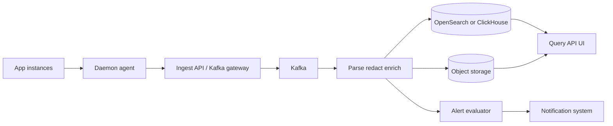
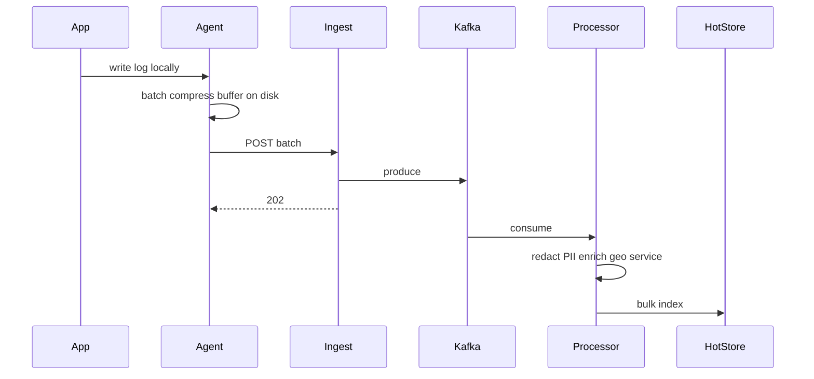

# Centralized Logging Service

Design a multi-tenant logging platform that ingests high-volume structured logs, makes them searchable, retains them cheaply over time, and supports alerting — without becoming a synchronous dependency of application request paths.

## Clarifying questions

- Who are tenants (internal services vs external customers)?
- Volume: GB/day or events/s? Peak multiplier?
- Query patterns: recent debug vs historical audit?
- Retention tiers (7 hot / 30 warm / 365 cold)?
- PII redaction and legal hold / deletion (GDPR)?
- Alerting from logs vs metrics preferred?
- Agent-based collection vs HTTP ingest API?

## Functional requirements

1. Ingest structured logs (JSON) in batches.
2. Authenticate tenants; enforce quotas.
3. Parse/enrich/redact; index searchable fields.
4. Query/search UI or API over time range.
5. Retention tiering and deletion.
6. Alert rules on query matches / thresholds.
7. Buffer during spikes; durable when possible.

## Non-functional requirements

| Attribute | Target (example) |
|---|---|
| Ingest durability | Prefer at-least-once; limited loss only if agent buffer overflows |
| Query latency | Seconds for recent hot data; longer for cold |
| Isolation | Noisy tenant cannot take down cluster |
| Cardinality safety | Guard high-cardinality labels |
| Privacy | Redact secrets/PII before index |

## Capacity estimation (example)

- 500 services × 2k events/s peak aggregate = 1M events/s
- Avg event 500 bytes → ~500 MB/s raw; ~100–200 MB/s compressed
- Hot retention 7 days → tens to hundreds of TB indexed
- Cold: object storage much cheaper
- Fan-in: thousands of agents

Always separate **ingest path capacity** from **query capacity**.

## API design

```
POST /v1/logs/batch
Authorization: Bearer <tenant-token>
Content-Type: application/x-ndjson
Body: newline-delimited JSON events
→ 202 { accepted, dropped }

GET /v1/logs/search?q=level:error AND service:checkout&from=&to=&limit=
→ { hits[], nextCursor }

POST /v1/alerts
Body: { name, query, window, threshold, channels }

GET /v1/usage   // quota
```

Agent protocol may use OTLP, Fluent Forward, or syslog — mention compatibility.

Event schema (suggested):

```json
{
  "timestamp": "2026-07-11T10:00:00.123Z",
  "tenantId": "t1",
  "service": "orders",
  "level": "error",
  "traceId": "abc",
  "message": "payment failed",
  "attributes": { "orderId": "o1" }
}
```

## Data model

- **Hot index**: inverted index / columnar store documents partitioned by `(tenant_id, time)`.
- **Warm/cold**: compressed segments in object storage; restore or query via scan engine.
- **Metadata DB**: tenants, API keys, retention policies, alert defs, dashboards.
- **Dedup** optional via event id hash (short window).

## High-level architecture



## Sequence: ingest to search



## Caching

- Query result cache for identical popular queries (short TTL).
- Tenant config / retention cached on ingest nodes.
- Field dictionary / schema registry cached.
- Agents buffer on local disk — critical for spikes.

## Database / store choice

| Store | Role |
|---|---|
| Kafka | Durable ingest buffer / fan-out |
| OpenSearch / Elasticsearch | Full-text search of recent logs |
| ClickHouse | High-volume analytical log queries |
| S3 + Parquet | Cheap long retention |
| PostgreSQL | Tenants, alerts, billing usage |
| Redis | Rate limits / quotas |

Common interview answer: **Agent → Kafka → processors → OpenSearch hot + S3 cold**.

## Scaling

- Partition Kafka by tenant (watch hot tenants — sub-partition).
- Independent autoscaling: ingest, processors, query nodes.
- Shard hot index by time + tenant.
- Sample or drop debug logs under pressure (priority: error/fatal first).
- Separate query clusters from ingest to avoid rebalance pain.

## Bottlenecks

1. Hot tenant cardinality explosion (`userId` as indexed field).
2. Wide fan-out mappings in Elasticsearch.
3. Kafka disk when consumers lag.
4. Heavy regex queries on huge time ranges.
5. Alert evaluation scanning too much data — prefer metrics for SLOs.

## Failure modes

| Failure | Mitigation |
|---|---|
| Ingest API down | Agent disk buffer; retry with backoff |
| Kafka full | Backpressure; shed low-severity; page on-call |
| Indexer lag | Scale processors; reduce indexing fields |
| Partial loss | Accept rare loss at agent overflow; document SLO |
| PII leak | Redaction pipeline + deny-list; audit |
| Noisy neighbor | Per-tenant quotas; separate high-value tenants |

## Retention and cost

- Hot 3–7 days indexed.
- Warm compressed 30 days.
- Cold archive 1 year+.
- Downsample debug; keep errors longer.
- Re-index from cold only when needed (expensive).

## Trade-offs

- Index everything vs structured allowlisted fields.
- Exact full-fidelity logs vs sampling.
- Push agents vs pull.
- Logs for alerting vs metrics/traces (OpenTelemetry story).
- Self-host ELK vs vendor (Datadog) — build vs buy.

## Interview talking points

- Apps must **never** block request path on remote log ship (async local).
- Correlation with `traceId` / `requestId`.
- PII redaction **before** persistence.
- Quotas and cardinality guards show production experience.
- Hot/warm/cold is the cost control narrative.
- Backpressure and agent buffers for spikes.

## Deep-dive prompts

- Multi-region residency (EU logs stay in EU).
- GDPR deletion across hot and cold tiers.
- Detect secrets in logs (AWS keys) and auto-redact + alert.
- Cost attribution per team.
