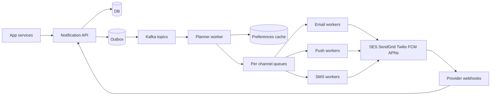
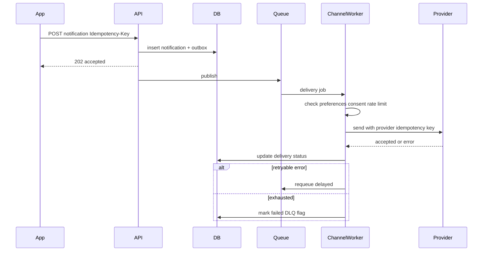

# Multi-channel Notification System

Design a platform that accepts notification requests and delivers them via email, push, SMS, and in-app channels with retries, preferences, and observability.

## Clarifying questions

- Channels in scope (email, SMS, push, in-app, webhook)?
- Synchronous “accepted” vs wait for provider delivery?
- Per-user preferences, quiet hours, unsubscribe / consent?
- Priority / transactional vs marketing?
- Multi-tenant SaaS with per-tenant quotas?
- Expected volume (notifications/day) and peak?
- Idempotency and deduplication windows?

## Functional requirements

1. Accept a notification request (template + data + channels).
2. Respect user preferences and legal consent.
3. Render templates; send via providers; track delivery status.
4. Retry transient failures; dead-letter exhausted attempts.
5. Provide status API and basic analytics.
6. Rate-limit per tenant/channel/user.

## Non-functional requirements

| Attribute | Target (example) |
|---|---|
| Accept latency | p99 &lt; 100–200 ms (enqueue) |
| Delivery | Best-effort with bounded retries; SLO per channel |
| Durability | Accepted requests not lost (outbox + queue) |
| Exactly-once to user | Not guaranteed; at-least-once + provider idempotency |
| Isolation | Noisy tenant cannot starve others |

## Capacity estimation (example)

- 100M notifications/day ≈ 1.2k/s avg; peak 6k/s
- 70% push, 25% email, 5% SMS
- Payload metadata 1 KB → ~6 MB/s peak ingest
- Each notification → 1–3 delivery attempts → worker throughput sized for 3× peak
- Retention of delivery logs 30–90 days

## API design

```
POST /v1/notifications
Idempotency-Key: <key>
Body: {
  "userId": "u_123",
  "templateId": "order_shipped",
  "channels": ["push", "email"],
  "data": { "orderId": "..." },
  "priority": "high"
}
→ 202 { "id": "n_...", "status": "accepted" }

GET /v1/notifications/{id}
→ { id, status, deliveries: [{ channel, status, attempts, lastError }] }

PUT /v1/users/{id}/preferences
Body: { email: true, sms: false, push: true, quietHours: { start, end, tz } }

POST /v1/templates
GET  /v1/unsubscribe/{token}   // email one-click
```

Gateway returns **202 Accepted** = durably queued, not delivered.

## Data model

### `notifications`

`{ id, idempotency_key UNIQUE, tenant_id, user_id, template_id, payload, status, created_at }`  
Statuses: `accepted → planned → sending → delivered|partial|failed`.

### `deliveries`

`{ id, notification_id, channel, provider, status, attempts, next_attempt_at, last_error, provider_message_id }`  
Index: `(status, next_attempt_at)` for retry workers.

### `preferences` / `consents`

Per user/tenant/channel; store unsubscribe tokens; never send SMS/email without consent where required.

### `templates`

Versioned templates per channel (subject/body); locale variants.

## High-level architecture



## Sequence: accept and deliver



## Caching

- Preferences and templates in Redis (TTL + invalidate on update).
- Tenant rate-limit counters in Redis.
- Hot template render partials.
- Do not cache “delivered” as source of truth — DB/webhook is truth.

## Database choice

| Store | Role |
|---|---|
| PostgreSQL | Notifications, deliveries, preferences, templates |
| Kafka / SQS / RabbitMQ | Durable async fan-out |
| Redis | Rate limits, preference cache |
| ClickHouse / warehouse | Analytics aggregates |
| Object storage | Large template assets / raw webhook archive |

SQL fits transactional outbox + status queries well.

## Scaling

- Partition Kafka by `tenant_id` or `notification_id`.
- Separate worker pools per channel (SMS cost/rate differs).
- Priority queues for transactional vs marketing.
- Horizontal API; scale workers by lag metrics.
- Provider-specific circuit breakers and bulkheads.

## Bottlenecks

1. Provider rate limits and outages.
2. Head-of-line blocking if one queue mixes priorities.
3. Preference lookup storms — cache.
4. Webhook bursts updating delivery rows.
5. Template rendering CPU on large batches — pre-render or pool.

## Failure modes

| Failure | Mitigation |
|---|---|
| Duplicate POST | Idempotency key unique constraint |
| Worker crash after send | Provider idempotency key; webhook reconcile |
| Provider 5xx | Exponential backoff + jitter; failover secondary provider |
| Provider 4xx (bad address) | Fail permanent; do not infinite retry |
| Preference changed mid-flight | Re-check before each attempt |
| Queue poison message | DLQ + alert + replay tooling |

## Trade-offs

- Sync wait for delivery increases latency and coupling — avoid for multi-channel.
- Exactly-once impossible across providers; aim for **at-least-once + dedupe**.
- Single queue simplicity vs per-channel isolation.
- Storing full payload vs pointer to fetch data at send time (PII minimization).

## Interview talking points

- **Accepted ≠ delivered** — educate product and design APIs accordingly.
- Consent/unsubscribe before enqueue when possible.
- Classify errors: retryable vs permanent.
- DLQ must be visible and replayable.
- Transactional outbox avoids dual-write loss between DB and Kafka.
- Quiet hours and digest batching for marketing channels.

## Deep-dive prompts

- Design per-tenant fair scheduling.
- How do you dedupe “order shipped” if inventory service retries?
- Multi-region active-active notifications.
- Cost controls for SMS at peak.
