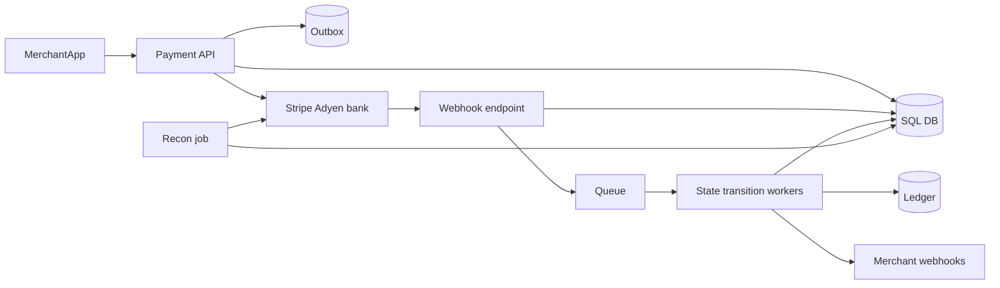
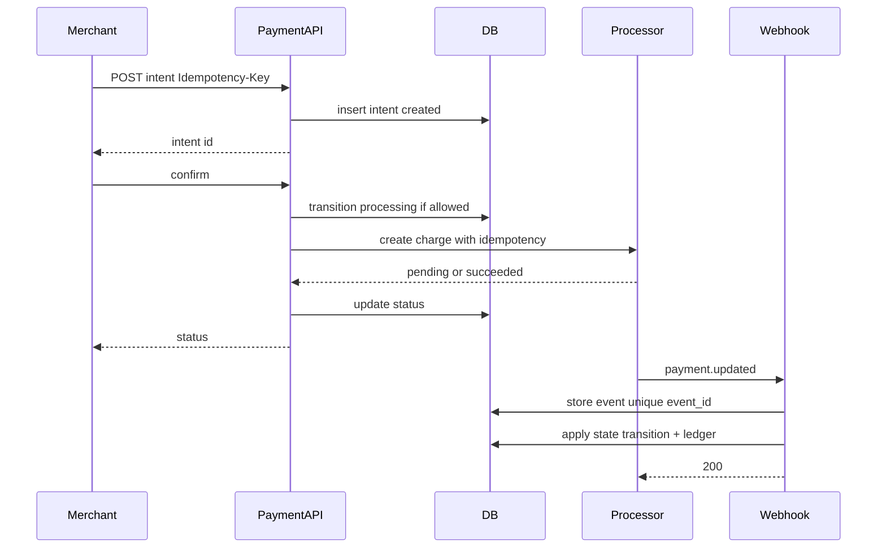

# Payment Gateway

Design a payment orchestration layer that creates payment intents, talks to processors, handles webhooks, refunds, and maintains an auditable ledger — without expanding PCI scope unnecessarily.

## Clarifying questions

- Card payments only or wallets/UPI/ACH?
- Auth+capture vs sale? Partial captures/refunds?
- Marketplace / split payments / multi-merchant?
- Who is merchant of record? PCI SAQ level target?
- Idempotency and client retry expectations?
- Settlement reporting and reconciliation frequency?
- Volume: payments/day, peak QPS, average ticket size?

## Functional requirements

1. Create and confirm payment intents.
2. Prevent double charges under retries.
3. Receive and verify processor webhooks.
4. Refunds and cancellations with state machine.
5. Immutable ledger / audit trail.
6. Merchant-facing status APIs and reconciliation jobs.

## Non-functional requirements

| Attribute | Target (example) |
|---|---|
| Correctness | No silent double charge; money movements auditable |
| Latency | Authorize p99 a few seconds (processor-bound) |
| Availability | Accept intents even if capture async; degrade gracefully |
| Security | No raw PAN on our servers; encrypt secrets; least privilege |
| Compliance | PCI scope minimized; audit logs retained |

## Capacity estimation (example)

- 5M payments/day ≈ 60/s avg; peak 300/s
- Each payment: 5–20 DB writes over lifecycle + webhook events
- Ledger entries grow faster than intents (authorize, capture, fee, refund)
- Retention: financial data years (legal), not 30 days

Peak is usually modest vs social apps; **correctness beats QPS heroics**.

## API design

```
POST /v1/payment-intents
Idempotency-Key: <merchant-key>
Body: { amount, currency, customerId, paymentMethodToken, captureMethod }
→ 201 { id, status: requires_confirmation|processing|succeeded|... }

POST /v1/payment-intents/{id}/confirm

POST /v1/refunds
Idempotency-Key: ...
Body: { paymentIntentId, amount, reason }

GET /v1/payment-intents/{id}

POST /v1/webhooks/{provider}
  Headers: signature
  Body: provider event
→ 200 quickly after durable enqueue
```

Rules:

- Amounts as **integer minor units** + ISO currency.
- Idempotency scoped per merchant: unique `(merchant_id, idempotency_key)`.
- Never trust client for final success — processor + webhook/retrieve.

## Data model

### `payment_intents`

`{ id, merchant_id, amount, currency, status, payment_method_token_ref, processor_ref, idempotency_key, created_at, updated_at }`  
Unique `(merchant_id, idempotency_key)`.

Statuses (simplified): `created → requires_action → processing → succeeded | failed | canceled` (+ `partially_refunded`, `refunded`).

### `refunds`

`{ id, payment_intent_id, amount, status, idempotency_key, processor_ref }`

### `ledger_entries` (append-only)

`{ id, tx_group_id, account, debit, credit, currency, created_at, meta }`  
Invariant: for each `tx_group_id`, debits == credits.

### `webhook_events`

`{ id, provider, event_id UNIQUE, payload, processed_at }` — dedupe by provider event id.

### `reconciliation_runs`

Daily diffs vs processor settlement files.

## High-level architecture



Keep PAN data at processor; store only tokens / payment method IDs.

## Sequence: confirm payment



## Caching

- Cache merchant config and fee schedules.
- Do **not** cache payment status as sole truth for money decisions — always reconcile with DB.
- Short-lived locks / optimistic version column on intent row for transitions.

## Database choice

| Store | Role |
|---|---|
| PostgreSQL | Intents, refunds, ledger, webhook dedupe (strong consistency) |
| Redis | Rate limits, distributed locks (optional), idempotency cache |
| Object storage | Settlement files, PCI evidence packs |
| Queue | Async merchant notifications, recon |

**SQL is the default** for payments. Avoid multi-shard chaos for money rows until forced; shard by `merchant_id` if needed.

## Scaling

- Horizontal API; serialize transitions per `payment_intent_id` (row lock / version).
- Async everything after authorize where product allows.
- Partition webhook processing by intent id.
- Read replicas for dashboards only — not for capture decisions.

## Bottlenecks

1. Processor latency and rate limits.
2. Hot merchant shooting retries (amplifies load) — idempotency absorbs.
3. Webhook storms.
4. Ledger write amplification.
5. Lock contention on single intent under parallel webhooks + client confirms.

## Failure modes

| Failure | Mitigation |
|---|---|
| Client retries create | Idempotency key returns same intent |
| Timeout after processor charge | Retrieve by processor idempotency key; webhook completes state |
| Duplicate webhooks | Unique `event_id`; noop if applied |
| Partial refund races | Conditional updates on remaining refundable amount |
| DB down mid-flight | Intent stays `processing`; recon + retrieve job |
| Poison merchant webhook | Isolate outbound retries; do not block money state |

## Consistency model

You cannot have a distributed ACID transaction with Stripe. Use:

1. Local state machine with legal transitions.
2. Idempotent processor calls.
3. Webhooks + polling retrieve as dual signals.
4. Compensating refunds when needed.
5. Daily reconciliation as safety net.

## Trade-offs

- Sync confirm vs async: sync simpler UX, longer request; async needs client polling/webhooks.
- Ledger in same DB vs separate accounting service — start same DB.
- Multi-processor routing adds resiliency and complexity.
- Holding funds / auth expiry policies are product+risk decisions.

## Interview talking points

- **Idempotency** is the star of the interview — design it carefully.
- Verify webhook signatures; treat body as untrusted.
- PCI: tokens, hosted fields, never log PAN/CVV.
- Distinguish authorize, capture, settle, refund.
- Append-only ledger + recon beats “update balance in place” alone.
- Money status is a state machine; illegal transitions must hard-fail.

## Deep-dive prompts

- Design idempotency store semantics (request hash mismatch?).
- Marketplace split payments and seller payouts.
- Exactly-once merchant webhooks outbound.
- Handling chargebacks / disputes.
