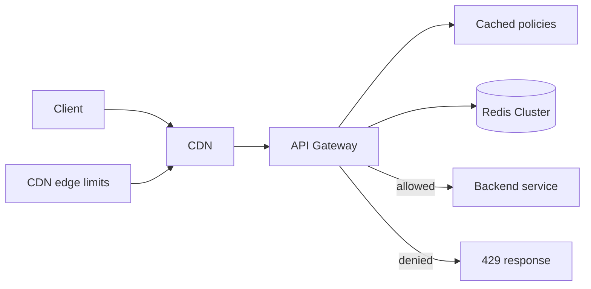
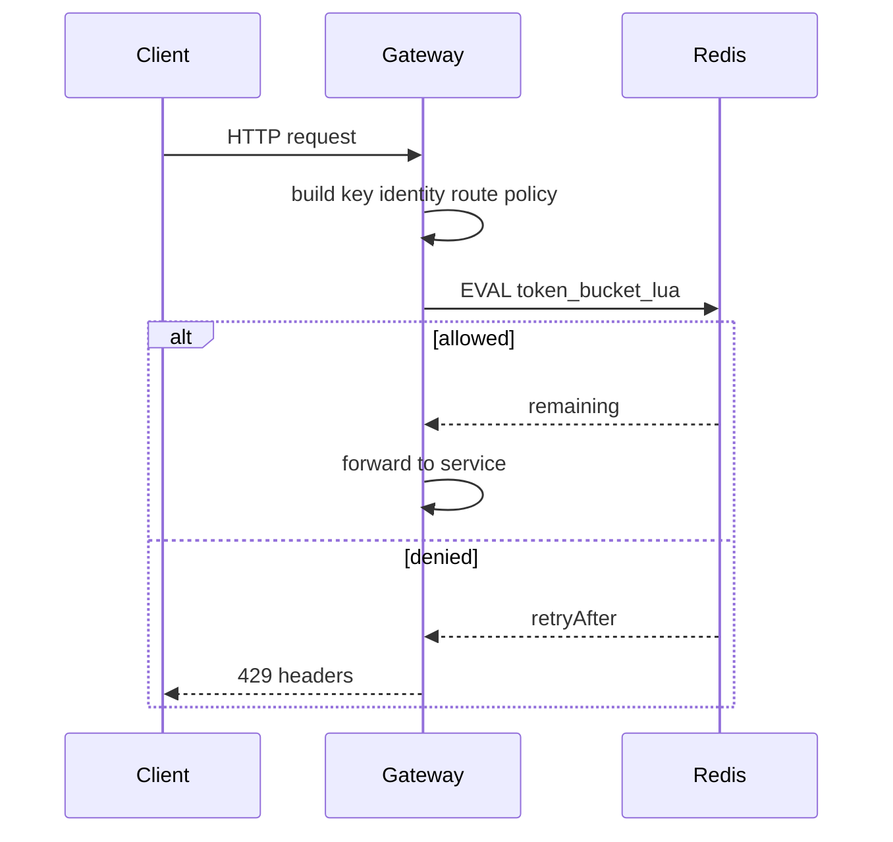

# Distributed Rate Limiter

Design a rate-limiting service (or middleware) that enforces fair quotas across many API gateway / service instances with low decision latency.

## Clarifying questions

- Limit by IP, user id, API key, route, tenant, or combination?
- Different quotas per plan (free/pro)?
- Burst allowed? Exact fairness vs approximate?
- Global limit vs per-region?
- Fail-open (allow) vs fail-closed (reject) if store is down?
- Response contract: `429` + `Retry-After` + remaining headers?
- Peak QPS through the limiter itself?

## Functional requirements

1. Allow or deny a request based on configured rules.
2. Support multiple dimensions (key = identity + route + policy).
3. Return remaining quota and reset/retry timing.
4. Admin APIs to CRUD rules / plans (optional in interview).
5. Observability: throttle rate per key/rule.

## Non-functional requirements

| Attribute | Target (example) |
|---|---|
| Decision latency | p99 &lt; 5–10 ms in-region |
| Accuracy | Small overshoot OK under concurrency; document bound |
| Availability | Prefer predictable behavior under Redis blips |
| Throughput | Must handle full gateway QPS (e.g. 100k+/s with sharding) |

## Capacity estimation (example)

- Gateway peak 50k RPS; every request checks limiter → 50k Redis ops/s
- With Lua token bucket, ~1 RTT each; need Redis Cluster sharded by key
- Rule configs: thousands of tenants × dozens of routes — cache in memory on gateway
- Header overhead negligible vs application work

## Algorithms (know 3+)

| Algorithm | Behavior | Memory | Notes |
|---|---|---|---|
| Fixed window | N per window | Low | Boundary burst 2N |
| Sliding window log | Precise | High | Store timestamps |
| Sliding window counter | Approx | Low | Good compromise |
| Token bucket | Sustained rate + burst | Low | Popular for APIs |
| Leaky bucket | Smooth egress | Low | Shapes traffic |

Interview default: **token bucket in Redis Lua** (atomic).

## API design

Internal decision API or library:

```
POST /v1/rate-limit/check
Body: { "key": "user:42:route:POST:/v1/orders", "cost": 1, "ruleId": "pro_default" }
→ 200 { "allowed": true, "remaining": 83, "limit": 100, "resetMs": 1200 }

→ 200 { "allowed": false, "remaining": 0, "retryAfterMs": 350 }
```

Gateway middleware:

```
X-RateLimit-Limit: 100
X-RateLimit-Remaining: 83
X-RateLimit-Reset: 1710000120
Retry-After: 1
```

External admin (optional):

```
PUT /v1/policies/{id} { windowSeconds, limit, burst }
```

## Data model

### Policy / rule

`{ id, scope, limit, window_seconds, burst, cost_default }`

### Redis key

`rl:{policyId}:{identity}` → token bucket state:

- `tokens`
- `last_refill_ts`

TTL slightly above window to auto-expire idle keys.

Local config cache: policy documents versioned (`etag` / `version`).

## High-level architecture



Optional central RateLimit service vs **library + Redis** embedded in gateway (lower latency).

## Sequence: check



## Caching

- Policy definitions cached on each gateway instance; push or poll updates.
- Optional local **approximate** limiter in front of Redis for ultra-hot paths (accepts drift).
- Negative: do not “cache allow forever”.

## Database choice

- **Redis Cluster** for counters (micro-latency, atomic Lua/scripts).
- SQL/etcd for policy source of truth.
- Avoid SQL for per-request counters.

## Scaling

- Hash tags / shard by identity so one key lives on one Redis node.
- Read-only replicas do not help much for increments — shard writes.
- Edge/CDN coarse limits (IP) before origin for DDoS.
- Per-route costs: expensive search query `cost=5`.
- Region-local limiters for latency; global limits need a global store or accepting soft global.

## Bottlenecks

1. Redis CPU / network at high RPS.
2. Hot keys (one celebrity API key) — local + Redis hybrid or key splitting with aggregation.
3. Oversized identity cardinality (IP spam) — memory pressure; use approximate structures / shorter TTL.
4. Synchronous remote call on every request — keep RTT in-AZ.

## Failure modes

| Mode | Choice |
|---|---|
| Redis timeout | **Fail-open** (availability) vs **fail-closed** (protect DB) — product risk decision; often fail-open for reads, fail-closed for costly writes/login |
| Partial cluster outage | Affects subset of keys; monitor |
| Clock skew | Prefer Redis TIME in script for refill |
| Misconfigured infinite limit | Guardrails / max caps |
| Trusted IP spoofing | Use edge-provided client IP; never raw `X-Forwarded-For` without trust hop config |

## Trade-offs

- Exact global fairness vs latency (multi-region).
- Fixed window simplicity vs token bucket UX.
- Central service vs sidecar/library.
- Strong atomicity (Lua) vs eventual local counters.

## Interview talking points

- State algorithm choice and **boundary burst** weakness of fixed windows.
- Atomicity matters: GET+SET race undercounts enforcement.
- Headers and `429` semantics show API craft.
- Fail-open vs fail-closed is a senior talking point — tie to endpoint risk.
- Different costs per route; separate auth endpoints for stricter limits.
- DDoS ≠ application rate limit — need edge protection too.

## Deep-dive prompts

- Implement token bucket Lua mentally (refill math).
- Design rate limits for GraphQL (complexity-based cost).
- Quotas that reset monthly (persistent counters + Redis).
- Fair rate limiting across tenants on a shared worker queue.
