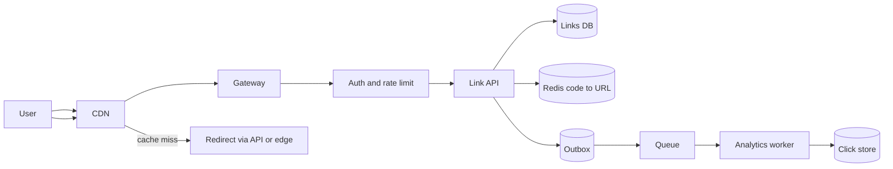
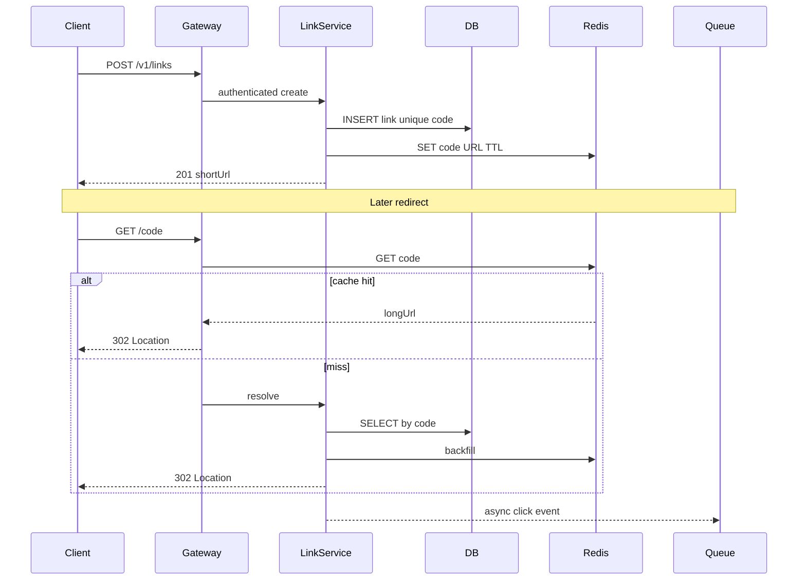

# URL Shortener

Design a service that turns long URLs into short, durable links and redirects with very low latency.

## Clarifying questions

- Custom aliases vs auto-generated codes only?
- Expiration, password protection, or one-time links?
- Analytics needed (clicks, geo, referrer)? Real-time or eventual?
- Expected DAU / peak QPS for create vs redirect?
- Multi-tenant (API customers) or single product?
- 301 (permanent, cacheable) vs 302 (temporary)?
- Abuse: open redirect spam, malware URLs?

## Functional requirements

1. Create a short link from a long URL (optional custom alias).
2. Redirect `GET /{code}` to the long URL quickly.
3. Optional: expire links, disable links, view analytics.
4. Authenticated create/manage for owners; public redirect.

## Non-functional requirements

| Attribute | Target (example — negotiate) |
|---|---|
| Redirect latency | p99 &lt; 50–100 ms at edge/service |
| Availability | 99.9%+ for redirects |
| Consistency | Create: durable write; redirect: read-your-writes for owner, eventual OK for caches |
| Durability | Codes must not silently disappear |
| Security | Rate limits, malware checks, auth for mutate ops |

## Capacity estimation (example assumptions)

Assumptions (state these aloud):

- 100M new links / month ≈ 40 links/sec average create; peak create ≈ 200/s
- Read:write ≈ 100:1 → peak redirect ≈ 20k QPS
- Code length 7 base62 ≈ 3.5e12 space (plenty)
- Metadata ≈ 500 bytes/link → 100M links ≈ 50 GB (+ indexes)
- Click events: 20k/s × 100 bytes ≈ 2 MB/s ingest; store asynchronously

Rough math interviewers expect:

```
Peak redirect QPS ≈ 20,000
Cache hit ratio target ≥ 90% → DB QPS ≈ 2,000
Redis memory for hot 10M keys × 200B ≈ 2 GB
```

## API design

```
POST /v1/links
Authorization: Bearer <token>
Idempotency-Key: <uuid>
Body: { "url": "https://...", "customAlias": "launch", "expiresAt": "2027-01-01T00:00:00Z" }
→ 201 { "code": "aB3xY9q", "shortUrl": "https://sho.rt/aB3xY9q" }

GET /{code}
→ 302 Location: <longUrl>
   Cache-Control: ...

GET /v1/links/{code}
→ 200 { code, url, createdAt, expiresAt, disabled }

DELETE /v1/links/{code}  (or PATCH disabled=true)

GET /v1/links/{code}/analytics?from=&to=
→ 200 { clicks, byDay[], topReferrers[] }
```

Notes:

- Validate URL scheme (http/https only).
- Idempotency key prevents duplicate codes on client retry.
- Prefer **302** if links can be disabled/updated; **301** only if permanent and immutable.
- Cursor pagination for `GET /v1/links` owner listing.

## Data model

### `links`

| Field | Notes |
|---|---|
| `code` | PK / unique; base62 or custom alias |
| `long_url` | validated |
| `owner_id` | FK / tenant |
| `created_at` | |
| `expires_at` | nullable; TTL job or query filter |
| `disabled` | bool |
| `click_count` | optional denormalized approx |

Indexes: unique `code`; `(owner_id, created_at)`.

### `click_events` (append-only)

`{ id, code, occurred_at, country, referrer, ua_hash }` — partition by day; never on redirect critical path.

### ID generation options

1. **Counter + base62** — simple; needs coordination (Redis INCR or Snowflake).
2. **Random base62** — no central counter; retry on unique collision.
3. **Hash of URL** — collisions and non-unique short codes if same URL must map to one code (product choice).

Interview default: Snowflake/KSUID → base62, uniqueness constraint, rare collision retry.

## High-level architecture



Redirect-optimized path: CDN/edge cache or Redis lookup → 302. Writes go to primary DB then warm cache.

## Sequence: create + redirect



## Caching

- Key: `link:{code}` → `{ longUrl, disabled, expiresAt }`.
- TTL: hours to days; invalidate on disable/update/delete.
- CDN may cache 302 briefly if product allows stale redirects (usually short TTL).
- Stampede: singleflight / probabilistic early refresh for hot codes.
- Negative cache short TTL for unknown codes to blunt scanning.

## Database choice

| Store | Role |
|---|---|
| PostgreSQL / MySQL | Source of truth for links (ACID, unique codes) |
| Redis | Hot redirect cache |
| Cassandra / ClickHouse / object+parquet | High-volume click analytics |
| Optional DynamoDB | If global single-digit ms and simple key-value access |

For most interviews: **SQL primary + Redis + async analytics store**.

## Scaling

- Stateless link API behind load balancer.
- Read replicas for owner dashboards; redirects served from cache.
- Shard links by hash(code) if single DB cannot hold QPS/storage.
- Separate write (create) and read (redirect) fleets if needed.
- Rate-limit creates per API key; CAPTCHA / malware URL scanning async or sync based on risk.

## Bottlenecks

1. Redirect DB load if cache miss rate rises.
2. Unique code contention on hot custom aliases.
3. Analytics write amplification if synced on redirect.
4. Cache invalidation races (disabled link still redirecting).
5. Hot keys (viral short links) overwhelming one Redis shard — replicate or local cache.

## Failure modes

| Failure | Mitigation |
|---|---|
| Redis down | Fall back to DB; shed load; optional stale CDN |
| DB primary down | Fail creates; serve redirects from cache/CDN until failover |
| Duplicate create retry | Idempotency key returns same code |
| Expired/disabled | Check flags before 302; return 410/404 |
| Malicious URL | Blocklist, async scan, disable + audit |

## Trade-offs

- Random codes vs sequential: sequential leaks growth; random needs uniqueness checks.
- Exact click counts vs approximate: exact hurts latency; use async counters.
- 301 vs 302: 301 caches aggressively and fights “disable link”.
- Deleting expired rows saves storage vs keeping for audit/legal.

## Interview talking points

- Start with redirect SLO and read/write ratio — that drives cache + CDN.
- Never write analytics on the synchronous redirect path.
- Explain ID generation and collision handling in one minute.
- Discuss cache invalidation when a link is disabled.
- Mention abuse: rate limits, URL allowlist schemes, malware.
- Evolution: single SQL → cache → shard → multi-region active-passive for redirects.

## Deep-dive prompts to expect

- How do you generate unique short codes at 10k creates/sec?
- Design analytics for top links without slowing redirects.
- Multi-region: where is the source of truth? Conflict on custom aliases?
- How does a CDN know a link was just disabled?
