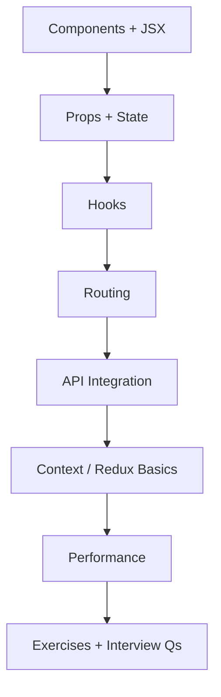
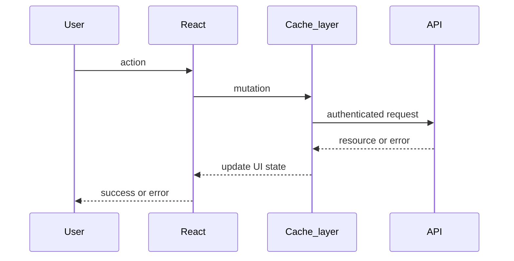

# 17 — React Basics (for Backend / Fullstack Interviews)

> React knowledge expected when you own APIs and collaborate on fullstack systems: components, hooks, routing, auth-aware data fetching, and performance.

---

## Who This Section Is For

- Node/API engineers interviewing for fullstack roles
- Backend developers who need crisp React mental models without becoming UI specialists
- Anyone wiring SPAs to JWT/cookie auth APIs

**Prerequisites:** Modern JavaScript (promises, modules). Familiarity with HTTP APIs helps.

---

## Learning Roadmap

| Phase | Topics | Focus | Est. Time |
|-------|--------|-------|-----------|
| **1. UI core** | Components, props/state | Unidirectional data flow | 1–2 days |
| **2. Effects** | Hooks | `useEffect`, custom hooks, rules | 1–2 days |
| **3. App shell** | Routing, API integration | Auth gates, loading/error | 1–2 days |
| **4. State scope** | Context/Redux, performance | Server vs client state | 1–2 days |
| **5. Drill** | Exercises + Interview Qs | Explain a fetch+cache flow | Ongoing |

---

## Topic Index

| # | Topic | Folder | Key Interview Themes |
|---|--------|--------|----------------------|
| 1 | [Components and JSX](./components-jsx/README.md) | `components-jsx/` | Composition, keys |
| 2 | [Props and State](./props-state/README.md) | `props-state/` | Controlled inputs, lifting state |
| 3 | [Hooks](./hooks/README.md) | `hooks/` | Effect deps, stale closures |
| 4 | [Routing](./routing/README.md) | `routing/` | Nested routes, loaders |
| 5 | [API Integration](./api-integration/README.md) | `api-integration/` | Fetch, credentials, errors |
| 6 | [Context and Redux](./context-redux/README.md) | `context-redux/` | Global vs server cache |
| 7 | [Performance](./performance/README.md) | `performance/` | Memoization boundaries |

**Practice**

- [Exercises](./exercises/README.md)
- [Interview Questions](./interview-questions/README.md)

---

## How to Study

1. Build a tiny login page that calls your Task or Auth API.
2. Separate **server state** (API data) from **UI state** (modals, tabs).
3. Practice explaining effect dependency arrays and cleanup (abort controllers).
4. Draw the request lifecycle below and narrate failure modes.
5. Prefer discussing React Query/SWR patterns even if you implement with `fetch`.

---

## Interview Focus

- Controlled vs uncontrolled inputs; lifting state.
- Why secrets never live in the frontend bundle.
- Handling 401: refresh flow vs redirect to login.
- Avoiding waterfalls; parallel fetches; list virtualization at a high level.

---

## Common Pitfalls

- Fetching in render without effect/guard.
- Storing JWTs in a way that maximizes XSS impact without discussion.
- Prop drilling everything instead of context/query cache.
- Premature `useMemo`/`useCallback` without a measured problem.

---

## Official Documentation

- [React Docs](https://react.dev/learn)
- [React Router](https://reactrouter.com/)
