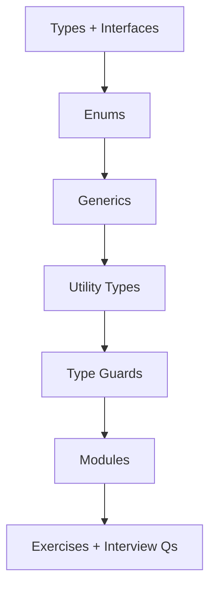

# 18 — TypeScript Basics

> Catch invalid assumptions at compile time. Still validate HTTP, DB, and queue payloads at runtime — TypeScript is not a security boundary.

---

## Who This Section Is For

- JavaScript developers moving Node/Express codebases to TypeScript
- Candidates asked about interfaces vs types, generics, and narrowing
- Anyone writing typed API handlers and shared DTOs

**Prerequisites:** Solid JavaScript. Node module basics.

---

## Learning Roadmap



| Phase | Topics | Focus | Est. Time |
|-------|--------|-------|-----------|
| **1. Core typing** | Types, interfaces, enums | Structural typing, unions | 1–2 days |
| **2. Reuse** | Generics, utility types | `Partial`, `Pick`, constraints | 1–2 days |
| **3. Narrowing** | Type guards, modules | Runtime checks + ESM/CJS | 1 day |
| **4. Drill** | Exercises + Interview Qs | Type a small Express handler | Ongoing |

---

## Topic Index

| # | Topic | Folder | Key Interview Themes |
|---|--------|--------|----------------------|
| 1 | [Types and Interfaces](./types-interfaces/README.md) | `types-interfaces/` | Extends vs intersection |
| 2 | [Enums](./enums/README.md) | `enums/` | Const enums, string unions |
| 3 | [Generics](./generics/README.md) | `generics/` | Constraints, inference |
| 4 | [Utility Types](./utility-types/README.md) | `utility-types/` | Mapped types toolkit |
| 5 | [Type Guards](./type-guards/README.md) | `type-guards/` | `in`, predicates, Zod |
| 6 | [Modules](./modules/README.md) | `modules/` | `NodeNext`, dual packages |

**Practice**

- [Exercises](./exercises/README.md)
- [Interview Questions](./interview-questions/README.md)

---

## How to Study

1. Enable `strict` and fix errors rather than loosening the compiler.
2. Type one domain model (Task, Order) end-to-end: DTO → service → response.
3. Prefer `string` union literals over numeric enums unless you need reverse mapping.
4. Pair compile-time types with Zod/Joi at the HTTP boundary.
5. Run `tsc --noEmit` on examples as a habit.

### Recommended server `tsconfig` sketch

```json
{
  "compilerOptions": {
    "target": "ES2022",
    "module": "NodeNext",
    "moduleResolution": "NodeNext",
    "strict": true,
    "noUncheckedIndexedAccess": true,
    "exactOptionalPropertyTypes": true,
    "esModuleInterop": true,
    "skipLibCheck": true
  }
}
```

---

## Interview Focus

- Structural typing: excess property checks on object literals.
- `unknown` vs `any`; never-`any` culture with escape hatches.
- Generics for repository/`ApiResponse<T>` patterns.
- Why `as` assertions are a smell at trust boundaries.

---

## Common Pitfalls

- Believing TypeScript validates JSON from the network.
- Overusing enums where unions suffice.
- `!` non-null assertions hiding null bugs.
- Mixing CJS `require` typings carelessly with ESM.

---

## Official Documentation

- [TypeScript Handbook](https://www.typescriptlang.org/docs/handbook/intro.html)
- [Utility Types](https://www.typescriptlang.org/docs/handbook/utility-types.html)
