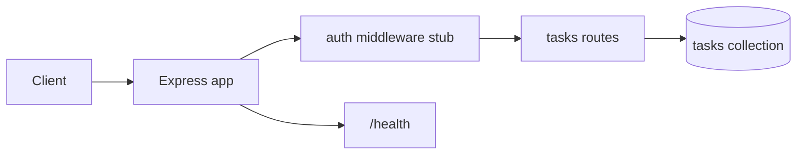

# Task API

Multi-user task manager with ownership checks, status/priority, due dates, and cursor pagination.

## Requirements

- Task model: `title`, `description`, `status`, `priority`, `dueDate`, `userId`
- Full CRUD under `/v1/tasks` with owner-scoped reads/writes
- Auth middleware stub that attaches `req.user` from `Authorization: Bearer <token>`
- Cursor pagination on list (`limit`, `cursor`) with compound index `{ userId, _id }`
- Zod validation at the route boundary; centralized Express error handler
- Health check, Helmet, request IDs, structured logging

## Architecture



## Folder structure

```text
01-task-api/
  README.md
  src/
    app.js
    server.js
    middleware/auth.js
    models/task.js
    routes/tasks.js
```

## Setup

```bash
cd 01-task-api
npm init -y
npm install express mongoose zod helmet pino-http dotenv
# optional: npm install jsonwebtoken  # when replacing the auth stub
```

Create `.env`:

```env
MONGODB_URI=mongodb://127.0.0.1:27017/task-api
PORT=3001
```

```bash
node src/server.js
```

For local demos without a real JWT, send header `x-demo-user: <userId>` (see auth middleware).

## API

| Method | Path | Auth | Description |
|--------|------|------|-------------|
| GET | `/health` | no | Liveness |
| POST | `/v1/tasks` | yes | Create task |
| GET | `/v1/tasks` | yes | List own tasks (`limit`, `cursor`, optional `status`) |
| GET | `/v1/tasks/:id` | yes | Get one (owner only) |
| PATCH | `/v1/tasks/:id` | yes | Update fields (owner only) |
| DELETE | `/v1/tasks/:id` | yes | Delete (owner only) |

### Example create body

```json
{
  "title": "Write interview notes",
  "description": "Cover event loop",
  "status": "todo",
  "priority": "high",
  "dueDate": "2026-07-20T00:00:00.000Z"
}
```

`status`: `todo` | `in_progress` | `done`  
`priority`: `low` | `medium` | `high`

## Interview talking points

- Ownership is enforced server-side on every ID-based route — never trust a client-supplied `userId` on write.
- List queries use `{ userId, _id: -1 }` so pagination stays index-backed.
- Cap `limit` (e.g. 100) to protect the database and response size.
- Auth stub is intentional: replace with JWT verify + load user; keep the same `req.user.id` contract.
- Discuss soft deletes, assignees, and labels as the next increment.

## Next production steps

Rate limiting, OpenAPI, integration tests with Supertest, real JWT middleware, and indexes on `{ userId, status, dueDate }` if you filter/sort that way.
