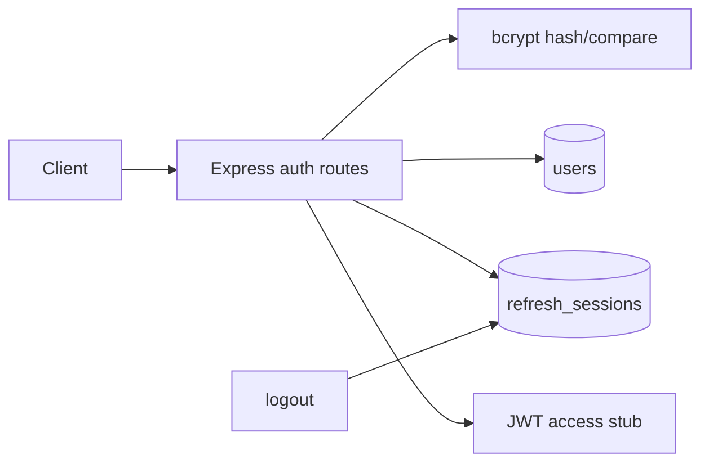

# Auth Service

Identity service with registration, login, bcrypt password hashing, JWT access + refresh stubs, and logout/revocation notes.

## Requirements

- User model: email (unique), passwordHash, name, roles
- RefreshSession model: userId, tokenHash, expiresAt, revokedAt
- `POST /v1/auth/register`, `POST /v1/auth/login`, `POST /v1/auth/refresh`, `POST /v1/auth/logout`
- bcrypt hash on register; compare on login (never store plaintext)
- Access JWT (short TTL) + refresh token (opaque, hashed at rest) stubs
- Document token blacklist / rotation / cookie transport for production

## Architecture



## Folder structure

```text
02-auth-service/
  README.md
  src/
    app.js
    server.js
    models/user.js
    models/refreshSession.js
    services/tokens.js
    routes/auth.js
```

## Setup

```bash
cd 02-auth-service
npm init -y
npm install express mongoose zod helmet pino-http dotenv bcrypt jsonwebtoken
```

```env
MONGODB_URI=mongodb://127.0.0.1:27017/auth-service
PORT=3002
JWT_ACCESS_SECRET=dev-only-change-me
JWT_ACCESS_TTL=15m
REFRESH_TTL_DAYS=7
BCRYPT_ROUNDS=12
```

```bash
node src/server.js
```

## API

| Method | Path | Description |
|--------|------|-------------|
| GET | `/health` | Liveness |
| POST | `/v1/auth/register` | Create user + issue tokens |
| POST | `/v1/auth/login` | Verify password + issue tokens |
| POST | `/v1/auth/refresh` | Rotate refresh; new access (+ refresh) |
| POST | `/v1/auth/logout` | Revoke refresh session |

### Register / login body

```json
{ "email": "ada@example.com", "password": "Str0ng-Pass!", "name": "Ada" }
```

### Token response shape

```json
{
  "user": { "id": "...", "email": "...", "name": "...", "roles": ["user"] },
  "accessToken": "<jwt>",
  "refreshToken": "<opaque>",
  "tokenType": "Bearer",
  "expiresIn": "15m"
}
```

## Production notes (interview)

- Store **hashes** of refresh tokens (SHA-256), not raw tokens.
- Rotate refresh on every use; detect reuse → revoke family (theft signal).
- Prefer HttpOnly + Secure + SameSite cookies for refresh in browsers; Bearer access in memory.
- “Blacklist” access JWTs only if you need immediate revoke before expiry (Redis denylist) — prefer short TTL.
- Rate-limit login/register; lockout / CAPTCHA after abuse.

## Interview talking points

- Why bcrypt cost factor and constant-time compare matter.
- Access vs refresh responsibilities and expiry.
- Logout is revoke-at-rest for refresh; access dies at TTL unless denylisted.
- Never log passwords or tokens.
