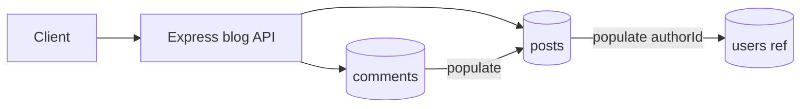

# Blog API

Publishing API with posts, comments, unique slugs, tags, populate, and soft delete.

## Requirements

- Post model: title, slug (unique), body, authorId, tags[], publishedAt, deletedAt
- Comment model: postId, authorId, body, deletedAt
- Create/list/get/update/soft-delete posts; add comments; populate author/comments
- Public reads exclude soft-deleted and unpublished (unless owner)
- Slug generated from title with uniqueness suffix

## Architecture



## Folder structure

```text
03-blog-api/
  README.md
  src/
    app.js
    server.js
    middleware/auth.js
    models/post.js
    models/comment.js
    routes/posts.js
    routes/comments.js
    utils/slugify.js
```

## Setup

```bash
cd 03-blog-api
npm init -y
npm install express mongoose zod helmet pino-http dotenv
```

```env
MONGODB_URI=mongodb://127.0.0.1:27017/blog-api
PORT=3003
```

```bash
node src/server.js
```

Auth: `Authorization: Bearer ...` or `x-demo-user: <ObjectId>`.

## API

| Method | Path | Auth | Description |
|--------|------|------|-------------|
| GET | `/health` | no | Liveness |
| POST | `/v1/posts` | yes | Create draft/published post |
| GET | `/v1/posts` | optional | List published (public) or own |
| GET | `/v1/posts/:idOrSlug` | optional | Get by id or slug |
| PATCH | `/v1/posts/:id` | yes | Update own post |
| DELETE | `/v1/posts/:id` | yes | Soft delete own post |
| POST | `/v1/posts/:postId/comments` | yes | Add comment |
| GET | `/v1/posts/:postId/comments` | no | List comments (populated) |

## Interview talking points

- Soft delete keeps history; queries must filter `deletedAt: null`.
- Populate is an extra query — select fields and avoid deep graphs on list endpoints.
- Unique slug + race: handle duplicate key and retry with suffix.
- Tags: multikey index for `tags` filter.

## Next production steps

Full-text search, draft workflow, moderation, rate limits, caching public post pages.
