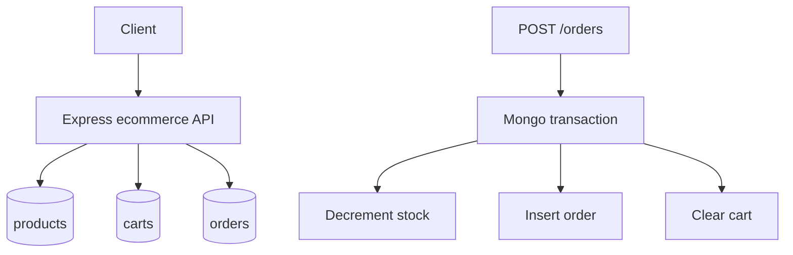

# E-commerce API

Checkout-focused API with products, carts, orders, stock checks, and an atomic order-create sketch.

## Requirements

- Product: name, sku, priceCents, stock
- Cart: userId, items[{ productId, qty }]
- Order: userId, items snapshot, totalCents, status, idempotencyKey
- Stock check on order create; decrement stock in a Mongo transaction
- Idempotency key on order create to make retries safe

## Architecture



## Folder structure

```text
04-ecommerce-api/
  README.md
  src/
    app.js
    server.js
    middleware/auth.js
    models/product.js
    models/cart.js
    models/order.js
    services/orderService.js
    routes/products.js
    routes/cart.js
    routes/orders.js
```

## Setup

```bash
cd 04-ecommerce-api
npm init -y
npm install express mongoose zod helmet pino-http dotenv
```

```env
MONGODB_URI=mongodb://127.0.0.1:27017/ecommerce-api
PORT=3004
```

Replica set required for multi-document transactions (local: `mongod --replSet rs0`).

```bash
node src/server.js
```

## API

| Method | Path | Auth | Description |
|--------|------|------|-------------|
| GET | `/health` | no | Liveness |
| POST | `/v1/products` | yes | Create product (admin stub) |
| GET | `/v1/products` | no | List products |
| GET | `/v1/cart` | yes | Get own cart |
| PUT | `/v1/cart/items` | yes | Upsert cart line |
| DELETE | `/v1/cart/items/:productId` | yes | Remove line |
| POST | `/v1/orders` | yes | Create order from cart (`Idempotency-Key`) |
| GET | `/v1/orders` | yes | List own orders |

## Interview talking points

- Inventory races: conditional update `stock >= qty` or transaction abort.
- Price snapshot on the order — catalog price may change later.
- Idempotency key unique per user prevents double charge on retry.
- Payment provider is out of process: mark `pending_payment` then webhook → `paid`.

## Next production steps

Reservations with TTL, payment webhooks, outbox for emails, inventory ledger.
