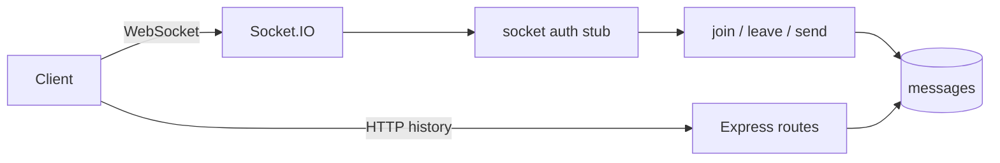

# Realtime Chat

Socket.IO chat with room join/leave, persisted messages, and REST history.

## Requirements

- Message model: roomId, senderId, body, createdAt
- REST: list message history for a room (cursor pagination)
- Socket.IO: authenticate on connect, `join_room`, `leave_room`, `send_message`
- Persist on send, ack to sender, broadcast to room
- Membership check sketch before join/send

## Architecture



## Folder structure

```text
05-realtime-chat/
  README.md
  src/
    app.js
    server.js
    socket.js
    middleware/auth.js
    models/message.js
    models/roomMember.js
    routes/messages.js
```

## Setup

```bash
cd 05-realtime-chat
npm init -y
npm install express mongoose zod helmet pino-http dotenv socket.io
```

```env
MONGODB_URI=mongodb://127.0.0.1:27017/realtime-chat
PORT=3005
```

```bash
node src/server.js
```

Client sketch: connect with `auth: { token: "..." }` or `extraHeaders: { "x-demo-user": "<id>" }`.

## API / Events

### HTTP

| Method | Path | Description |
|--------|------|-------------|
| GET | `/health` | Liveness |
| GET | `/v1/rooms/:roomId/messages` | History (`limit`, `cursor`) |

### Socket.IO events

| Event | Direction | Payload |
|-------|-----------|---------|
| `join_room` | client → server | `{ roomId }` |
| `leave_room` | client → server | `{ roomId }` |
| `send_message` | client → server | `{ roomId, body }` |
| `message` | server → room | saved message doc |
| `error_message` | server → client | `{ message }` |

## Interview talking points

- Horizontal scale needs Redis adapter + sticky sessions at the load balancer.
- Persist first, then broadcast — or use outbox if ack must survive crashes.
- Auth on handshake; never trust client-supplied `senderId`.
- Cursor history for reconnect catch-up after disconnect.

## Next production steps

Presence, typing indicators, delivery receipts, moderation, rate limits per socket.
