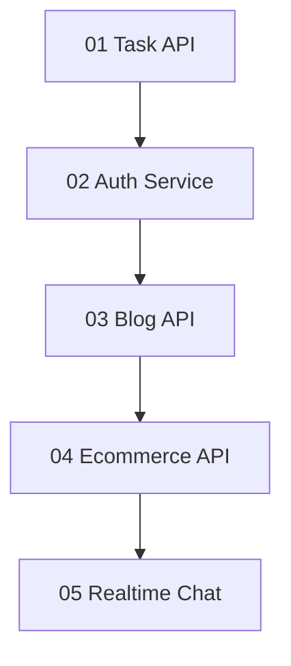

# 19 — Interview Mini-Projects

> Five distinct Express + Mongo/Mongoose starters. Build one vertical slice completely before expanding features.

---

## Who This Section Is For

- Candidates who need portfolio-ready API stories
- Learners who finished REST, auth, Mongo, and Mongoose theory
- Interviewers looking for concrete talking points (indexes, authZ, idempotency)

**Prerequisites:** [11-REST-API](../11-REST-API/README.md), [10-Authentication](../10-Authentication/README.md), [07-MongoDB](../07-MongoDB/README.md), [08-Mongoose](../08-Mongoose/README.md).

---

## Learning Roadmap

| Order | Project | Skills unlocked | Est. Time |
|-------|---------|-----------------|-----------|
| 1 | [Task API](./01-task-api/README.md) | CRUD, auth middleware stub, pagination | 2–4 days |
| 2 | [Auth Service](./02-auth-service/README.md) | bcrypt, JWT access/refresh, logout | 2–4 days |
| 3 | [Blog API](./03-blog-api/README.md) | Populate, soft delete, slugs, tags | 3–5 days |
| 4 | [E-commerce API](./04-ecommerce-api/README.md) | Stock, cart, order transaction sketch | 4–6 days |
| 5 | [Realtime Chat](./05-realtime-chat/README.md) | Socket.IO rooms, message persistence | 3–5 days |

---

## Projects

| # | Project | Domain models | Distinct focus |
|---|---------|---------------|----------------|
| 01 | [Task API](./01-task-api/README.md) | Task | Owner CRUD + cursor pagination |
| 02 | [Auth Service](./02-auth-service/README.md) | User, RefreshSession | Register/login/refresh/logout |
| 03 | [Blog API](./03-blog-api/README.md) | Post, Comment | Slug, tags, populate, soft delete |
| 04 | [E-commerce API](./04-ecommerce-api/README.md) | Product, Cart, Order | Stock check + order create |
| 05 | [Realtime Chat](./05-realtime-chat/README.md) | Message (+ rooms) | Socket.IO join/leave/send |

---

## How to Study

1. Read the project README (requirements + Mermaid) before opening code.
2. Run through the folder structure; rename nothing until you understand the domain.
3. Install deps listed in the project README; set `.env`; start Mongo; run `node src/server.js`.
4. Extend one unhappy path (401, validation, stock conflict, duplicate slug).
5. Prepare a 3-minute walkthrough: request path, indexes, failure mode, next production step.

---

## Delivery Checklist

- Every mutable endpoint is safe under client retry (or documents why not).
- Access-control decisions are server-side from trusted identity.
- Every list query has a supporting index and a bounded `limit`.
- Secrets are absent from source control; client errors leak no internals.
- You can name one trade-off and one metric you would alert on.

---

## Interview Focus

- Ownership vs role checks (Task/Blog vs admin).
- Refresh-token hashing and rotation (Auth).
- Soft delete + public read filters (Blog).
- Inventory race conditions and idempotency keys (E-commerce).
- Sticky sessions / Redis adapter for multi-node Socket.IO (Chat).

---

## Common Pitfalls

- Shipping all five as identical `/resources` stubs (these starters are domain-specific — keep them that way).
- Skipping indexes because “Mongo is fine.”
- Treating JWT logout as solved without a revocation story.
- Buffering entire chat history in memory instead of paging from Mongo.
