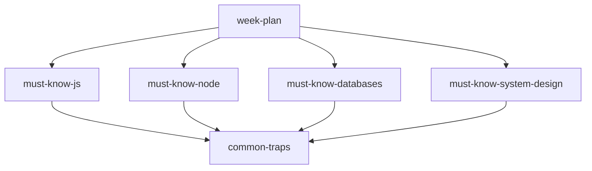

# 25 — Revision Notes

> Condensed “must know” packs and a week plan for last-mile interview prep. Pair with [24-Cheat-Sheets](../24-Cheat-Sheets/README.md) for syntax; use this folder for concepts and traps.

---

## Who This Section Is For

- Candidates with 3–14 days until interviews
- Engineers who already covered the main InterviewPrep sections
- Anyone who keeps failing the same conceptual traps

**Prerequisites:** Sections 01–15 at a working level; at least one project from [19-Projects](../19-Projects/README.md).

---

## How to Use

1. Start with [week-plan.md](./week-plan.md) and adapt hours to your calendar.
2. Each day: one must-know file + 30 minutes of coding + 20 minutes aloud Q&A.
3. Keep a personal “trap log” from [common-traps.md](./common-traps.md).
4. Do not expand scope — revise and ship clarity, not new frameworks.

---

## Notes Index

| Note | File | Focus |
|------|------|-------|
| Week plan | [week-plan.md](./week-plan.md) | Day-by-day schedule |
| Must-know JS | [must-know-js.md](./must-know-js.md) | Scope, closures, async, this |
| Must-know Node | [must-know-node.md](./must-know-node.md) | Event loop, modules, streams |
| Must-know databases | [must-know-databases.md](./must-know-databases.md) | Mongo + SQL trade-offs |
| Must-know system design | [must-know-system-design.md](./must-know-system-design.md) | APIs, scale, consistency |
| Common traps | [common-traps.md](./common-traps.md) | Frequent wrong answers |

---

## Study Roadmap

| Day band | Primary notes | Practice |
|----------|---------------|----------|
| Days 1–2 | JS + Node | Event-loop output drills |
| Days 3–4 | Databases | Index + transaction stories |
| Days 5–6 | System design | Draw Task/Auth/Chat architectures |
| Day 7 | Traps + cheat sheets | Mock interview (45 min) |

---

## Interview Focus

- Spaced repetition: short daily passes beat one long cram.
- Always answer with: definition → example → trade-off → failure mode.
- Link every system-design claim to something you built in projects.

---

## Common Pitfalls

- Re-reading notes passively without speaking answers.
- Skipping databases because “I’m a Node person.”
- Ignoring common traps until an interviewer hits them live.
- Studying new topics in week one of revision instead of sealing gaps.
