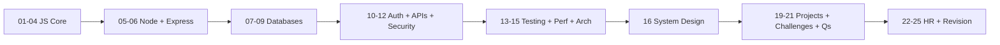

# Node.js Backend Interview Preparation

> A complete, production-quality interview preparation guide for **Node.js Backend Developers** (~4 years experience). Covers JavaScript fundamentals through system design, coding challenges, HR/behavioral prep, and real-world projects.

---

## Who This Is For

- Backend / full-stack developers preparing for Node.js interviews
- Engineers targeting startups, product companies, and FAANG-style rounds
- Anyone who wants a single, structured knowledge base instead of scattered resources

---

## Learning Roadmap

Follow sections in order. Each builds on the previous.



| Phase | Sections | Focus | Est. Time |
|-------|----------|-------|-----------|
| **1. Foundations** | 01–04 | JavaScript deeply | 2–3 weeks |
| **2. Backend Core** | 05–06 | Node.js + Express | 2 weeks |
| **3. Data Layer** | 07–09 | MongoDB, Mongoose, SQL | 2 weeks |
| **4. Production Skills** | 10–14 | Auth, REST, Security, Testing, Perf | 2–3 weeks |
| **5. Senior Topics** | 15–16 | Architecture + System Design | 1–2 weeks |
| **6. Stack Breadth** | 17–18 | React + TypeScript essentials | 1 week |
| **7. Practice** | 19–21 | Projects, challenges, Q&A | Ongoing |
| **8. Soft Skills** | 22–25 | HR, behavioral, cheat sheets | 3–5 days |

---

## Repository Structure

```
InterviewPrep/
├── 01-JavaScript-Fundamentals/   # Variables → GC
├── 02-ES6-Modern-JavaScript/     # let/const → BigInt
├── 03-Advanced-JavaScript/       # Event loop, prototypes, FP, SOLID
├── 04-Asynchronous-JavaScript/   # Callbacks → Streams
├── 05-NodeJS/                    # Architecture → Core modules
├── 06-ExpressJS/                 # Routing → API versioning
├── 07-MongoDB/                   # CRUD → Sharding
├── 08-Mongoose/                  # Schemas → Transactions
├── 09-SQL/                       # MySQL/PostgreSQL + interview SQL
├── 10-Authentication/            # JWT, OAuth, RBAC, bcrypt
├── 11-REST-API/                  # Production REST patterns
├── 12-Security/                  # OWASP, injections, Helmet
├── 13-Testing/                   # Jest + Supertest
├── 14-Performance/               # Redis, scaling, profiling
├── 15-Architecture/              # MVC → Microservices
├── 16-System-Design/             # URL shortener → E-commerce
├── 17-ReactJS-Basics/            # Backend-relevant React
├── 18-TypeScript-Basics/         # Types → Generics
├── 19-Projects/                  # 5 mini production projects
├── 20-Coding-Challenges/         # JS / Node / Mongo / SQL banks
├── 21-Interview-Questions/       # Categorized Q&A (all levels)
├── 22-HR-Interview/              # Sample answers (~4 YOE)
├── 23-Behavioral-Questions/      # STAR stories
├── 24-Cheat-Sheets/              # Quick revision cards
├── 25-Revision-Notes/            # Last-week cram notes
└── Resources/                    # Git, Docker, AWS, Redis, etc.
```

---

## How Each Topic Is Structured

Every concept folder typically includes:

| Artifact | Purpose |
|----------|---------|
| `README.md` | Theory, syntax, diagrams, best practices |
| `examples/` or inline examples | Runnable / copy-paste code |
| Common mistakes | What interviewers watch for |
| Performance notes | Time/space / Node-specific costs |
| Interview questions | With model answers |
| Exercises + solutions | Hands-on practice |
| Official docs links | Source of truth |

---

## Quick Start

1. Open [`STUDY_TRACKER.md`](./STUDY_TRACKER.md) and set your target interview date
2. Start at [`01-JavaScript-Fundamentals`](./01-JavaScript-Fundamentals/README.md)
3. Code along — do not only read
4. After each section, attempt its `interview-questions` and `exercises`
5. Build at least **2 projects** from [`19-Projects`](./19-Projects/README.md)
6. Drill [`20-Coding-Challenges`](./20-Coding-Challenges/README.md) daily (2–3 problems)
7. In the last 7 days before interviews, use [`25-Revision-Notes`](./25-Revision-Notes/README.md) + cheat sheets

---

## Practice Targets

| Category | Target Count |
|----------|--------------|
| JavaScript coding challenges | 300+ |
| Node.js coding challenges | 150+ |
| MongoDB problems | 100+ |
| SQL problems | 100+ |
| Categorized interview Q&A | 500+ |

---

## Interview Round Mapping

| Round | Prep From |
|-------|-----------|
| Online coding / JS DSA | `20-Coding-Challenges/javascript`, `01–03` |
| Machine coding | `Resources/machine-coding`, `19-Projects`, `11-REST-API` |
| Backend deep dive | `05–08`, `10–12`, `21-Interview-Questions` |
| System design | `15–16` |
| Managerial / HR | `22–23` |

---

## Conventions

- **Language:** Modern JavaScript (ES2023/ES2024), CommonJS + ESM where relevant
- **Style:** Clean architecture, production-minded snippets, commented code
- **Diagrams:** Mermaid in Markdown
- **Difficulty tags:** `Beginner` · `Intermediate` · `Advanced` · `Expert`

---

## Official References

- [Node.js Docs](https://nodejs.org/docs/latest/api/)
- [Express.js Guide](https://expressjs.com/en/guide/routing.html)
- [MDN JavaScript](https://developer.mozilla.org/en-US/docs/Web/JavaScript)
- [MongoDB Manual](https://www.mongodb.com/docs/manual/)
- [Mongoose Docs](https://mongoosejs.com/docs/)
- [PostgreSQL Docs](https://www.postgresql.org/docs/current/)
- [OWASP Top 10](https://owasp.org/www-project-top-ten/)
- [Jest Docs](https://jestjs.io/docs/getting-started)

---

## Suggested Weekly Plan (8 Weeks)

| Week | Focus |
|------|-------|
| 1 | JS Fundamentals + ES6 |
| 2 | Advanced JS + Async |
| 3 | Node.js internals + core modules |
| 4 | Express + REST + Auth |
| 5 | MongoDB + Mongoose + SQL |
| 6 | Security + Testing + Performance |
| 7 | Architecture + System Design + Projects |
| 8 | Coding drills + Interview Qs + HR + Revision |

---

## Contributing to Your Own Prep

Treat this as a living notebook:

- Add notes from real interviews under `Resources/` or `21-Interview-Questions/`
- Mark completed exercises with checkboxes
- Record weak topics in `25-Revision-Notes`

---

**Start here →** [`01-JavaScript-Fundamentals/README.md`](./01-JavaScript-Fundamentals/README.md)
