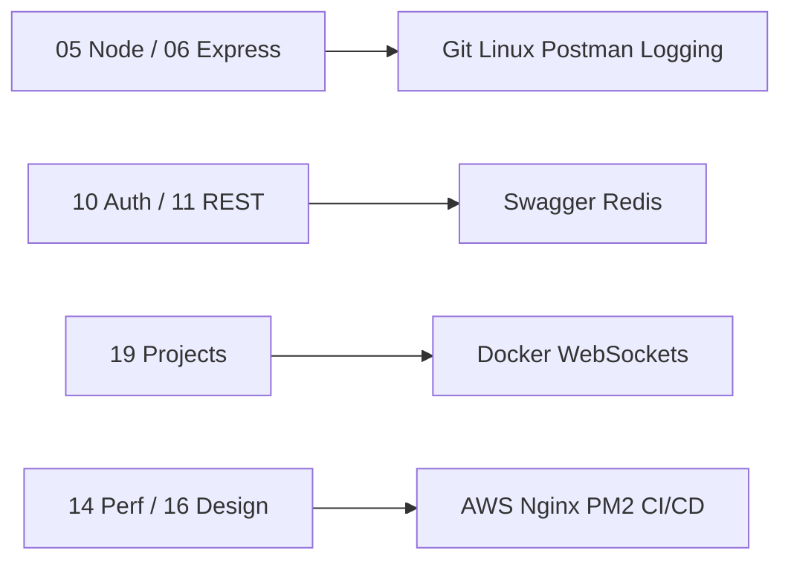

# Resources — Backend Interview Bonus Toolkit

Practical tooling every Node.js backend interview (and production job) expects you to touch. Use these guides for **commands, patterns, and interview talking points** — not as a replacement for the core curriculum in sections 01–16.

---

## When to Study These

| Timing | Focus |
|--------|-------|
| Alongside Node/Express | Git, Linux, env vars, Postman, logging |
| During projects | Docker, Redis, Swagger, WebSockets |
| Before senior / product rounds | CI/CD, AWS, Nginx/PM2, design patterns, machine coding |
| Last-week polish | Debugging playbook + machine coding checklist |

---

## Index

| Topic | Path | Interview angle |
|-------|------|-----------------|
| Git & GitHub | [git-github](./git-github/README.md) | Branching, rebase vs merge, PR hygiene |
| Linux | [linux](./linux/README.md) | Process, ports, logs, permissions |
| Docker & Compose | [docker](./docker/README.md) | Images, volumes, multi-service local stacks |
| Redis | [redis](./redis/README.md) | Cache, sessions, rate limits, queues |
| WebSockets / Socket.IO | [websockets](./websockets/README.md) | Realtime chat, rooms, scaling sticky sessions |
| Logging (Winston / Pino) | [logging](./logging/README.md) | Structured logs, request IDs, levels |
| Swagger / OpenAPI | [swagger](./swagger/README.md) | Contract-first APIs, docs as product |
| Postman | [postman](./postman/README.md) | Collections, env vars, auth flows |
| CI/CD | [cicd](./cicd/README.md) | Test → build → deploy pipelines |
| AWS (EC2, S3, IAM) | [aws](./aws/README.md) | Deploy Node, store files, least-privilege IAM |
| Nginx & PM2 | [nginx-pm2](./nginx-pm2/README.md) | Reverse proxy, SSL, process management |
| Webhooks | [webhooks](./webhooks/README.md) | Signatures, idempotency, retries |
| GraphQL & gRPC | [graphql-grpc](./graphql-grpc/README.md) | When REST is not enough |
| Design Patterns | [design-patterns](./design-patterns/README.md) | Factory, Strategy, Repository in Node |
| Debugging | [debugging](./debugging/README.md) | Node inspector, prod incident flow |
| Machine Coding | [machine-coding](./machine-coding/README.md) | Time-boxed API builds under pressure |

---

## Environment Variables (Quick Rules)

- Validate required env at **startup** (fail fast); never read secrets lazily mid-request without checks
- Keep `.env` out of git; use `.env.example` with placeholders only
- Separate `development` / `test` / `production` configs
- Do not log secrets, tokens, or full authorization headers
- Prefer a validated config module (`zod` / `envalid` / `joi`) over scattered `process.env` reads
- Rotate credentials; document every variable and its safe default (if any)

```js
// Example pattern (conceptual)
import { z } from 'zod';

const envSchema = z.object({
  NODE_ENV: z.enum(['development', 'test', 'production']),
  PORT: z.coerce.number().default(3000),
  DATABASE_URL: z.string().min(1),
  JWT_SECRET: z.string().min(32),
});

export const env = envSchema.parse(process.env);
```

---

## Suggested Pairing With Core Sections



---

## Related

- [Root roadmap](../README.md)
- [Study tracker](../STUDY_TRACKER.md)
- [Cheat sheets](../24-Cheat-Sheets/README.md)
- [Machine coding deep dive](./machine-coding/README.md)
